# Instalaciones y Configuraciones Previas

```
Nombre      : Alejandro de Paz Hernández
Curso       : 2º de Ciclo Superior de Administración de Sistemas Informáticos en Red
```

## 1. Introducción

En esta primera práctica, vamos a instalar y configurar las máquinas virtuales que utilizaremos más adelante en futuras prácticas. Necesitaremos instalar una máquina Windows Server 2016, una máquina Windows cliente (que en este caso será Windows 10) y dos máquinas Ubuntu 20.04, una server y otra cliente.

## 2. Instalación y configuración de las máquinas

### 2.1 Ubuntu Cliente

- Creamos una máquina virtual con las siguientes características e instalamos Ubuntu 20.04.

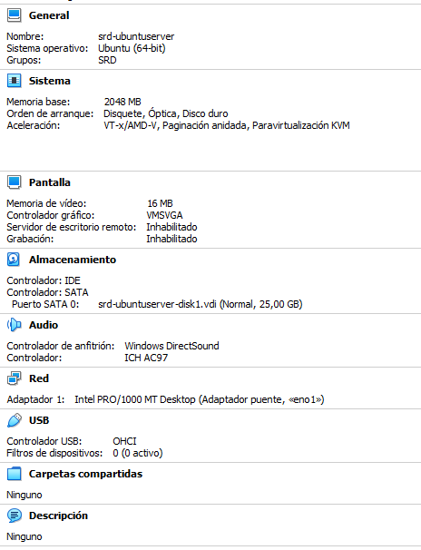

- Iniciamos la máquina y comprobamos que funciona:

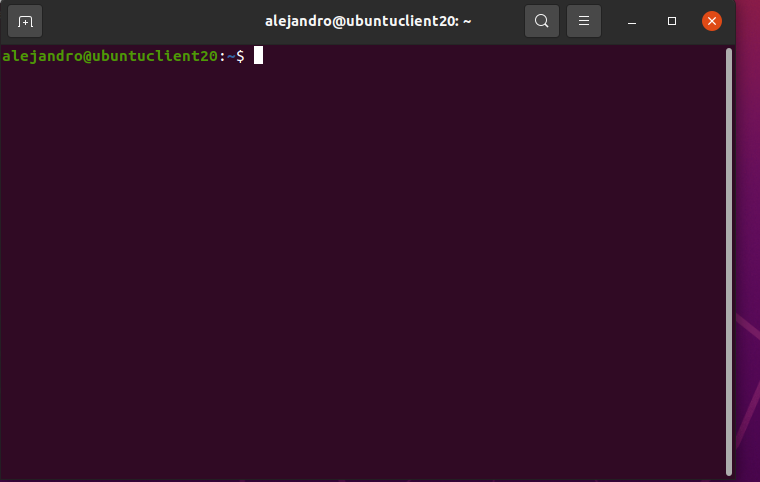

### 2.1 Ubuntu Server

- Para el Ubuntu Server, simplemente clonamos la máquina anterior y le añadimos una configuración de red estática:

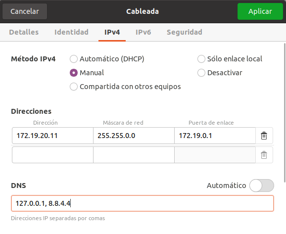

Más adelante lo seguiremos configurando para que actúe como servidor.

### 2.2 Windows Server y Cliente

- Creamos una máquina virtual con las siguientes características e instalamos Windows Server 2016:

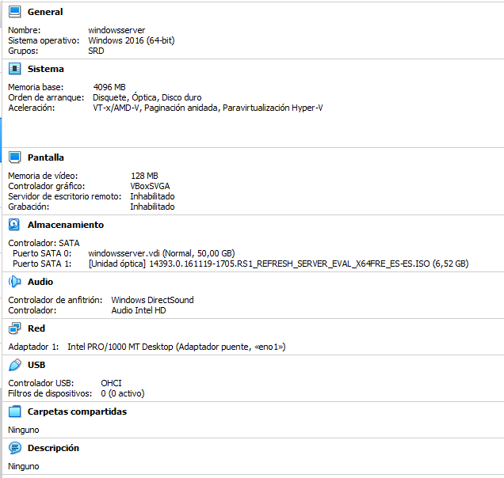

- Una vez dentro, le asignamos una configuración de red estática:

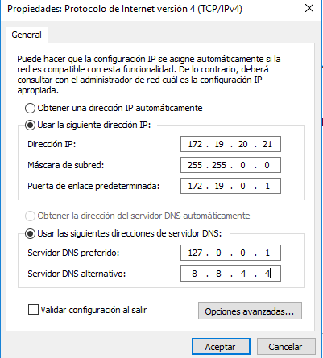

- A continuación, instalamos Active Directory y promovemos el servidor a Controlador de Dominio:

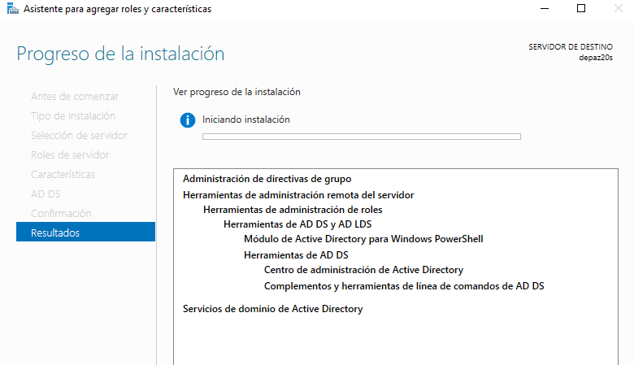


- Creamos un usuario, un grupo y una unidad organizativa de prueba:


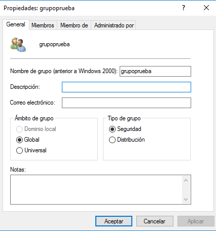

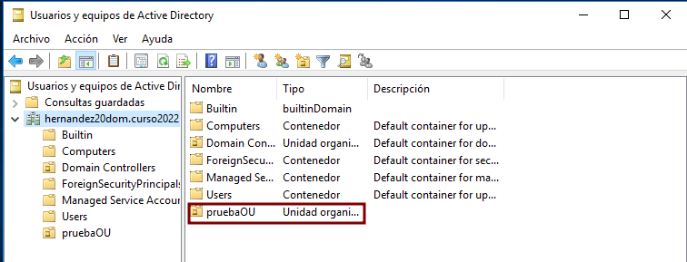

- Por último, vamos a la máquina cliente Windows 10 y la añadimos al dominio creado previamente en nuestro servidor:

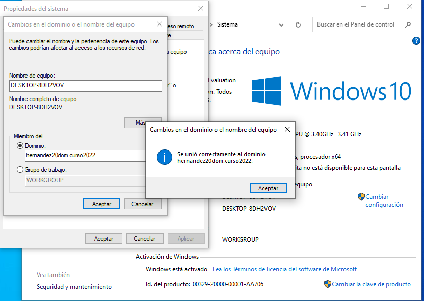

- Podemos ver que ahora la máquina cliente aparece en nuestro servidor:

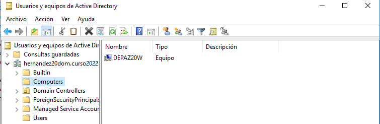

- Comprobamos que todo ha salido bien iniciando sesión con el usuario `alejandro` (que hemos creado previamente en el servidor) en nuestra máquina cliente.


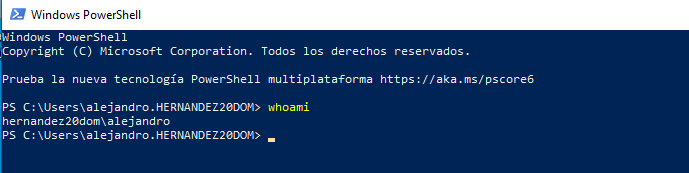
