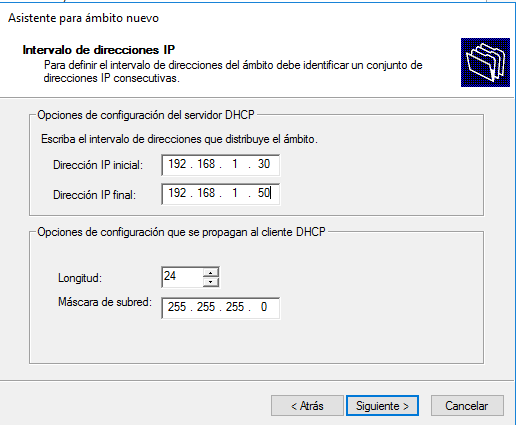

# Configuración e instalación de servicio DHCP en Windows

```
Nombre      : Alejandro de Paz Hernández
Curso       : 2º de Ciclo Superior de Administración de Sistemas Informáticos en Red
```

# 1. Introducción

En esta práctica vamos a configurar e instalar el servicio DHCP (Dynamic Host Configuration Protocol) en una máquina Windows Server 2016. Este servicio se utiliza en entornos cliente-servidor, de forma que proporcione la información establecida en el servidor al cliente (o clientes) automáticamente. Dicha información consiste en direcciones IP, máscaras de subred, puertas de enlace... En definitiva, información relacionada con la red.

---

# 2. Instalación del servicio DHCP

- Entramos en la máquina Windows Server y vamos a `Administrar el Servidor → Agregar roles y características`. Cuando lleguemos a roles del servidor, seleccionamos `Servidor DHCP` e instalamos:


- Una vez finalizada la instalación, nos aparecerá un triángulo amarillo en el administrador del servidor. Clickamos ahí e introducimos las credenciales de Administrador para dar de alta el servicio DHCP:


## 2.1 Ámbitos

- Ahora que tenemos instalado el servicio, vamos a configurarlo. Para ello, vamos a `Herramientas → Servidor DHCP` y creamos un nuevo ámbito. Esto nos abrirá un asistente:


- Seleccionamos el nombre del ámbito:


- A continuación, introducimos el intervalo de direcciones IP. Esto es el número y rango de IPs que queremos que proporcione nuestro servidor DHCP. En este caso daremos 21 direcciones IP, desde la **172.19.20.30** hasta la **172.19.20.50**


- También podemos agregar exclusiones, es decir, direcciones o rangos IP que no queremos que se proporcionen. En este caso se han excluido la IP **172.19.20.31** y el rango **172.19.20.40-172.19.20.45**. Por lo tanto, ningún cliente podrá obtener estas IPs y nuestro servidor solo podrá repartir 14 IPs:


- Otro parámetro a configurar es el tiempo de concesión, que es básicamente el tiempo que un cliente puede utilizar una dirección IP proporcionada por nuestro servidor:


- También podemos proporcionar una (o varias) puerta de enlace o gateway y servidores DNS:


- Una vez establecida la configuración inicial, creamos y activamos el ámbito:


- Dentro del ámbito, podemos configurar muchas otras opciones como las siguientes. También podemos configurar estas mismas opciones a nivel de servidor, es decir, que afecten a todos los ámbitos:


---

## 2.2 Cliente Windows

A continuación, vamos a entrar a la máquina cliente para comprobar que el servidor DHCP está proporcionando la información correctamente.

- Lo primero es establecer la IP del servidor en el DNS de la máquina cliente:


- Podemos comprobar que se está recurriendo a nuestro servidor DHCP y que la IP proporcionada está dentro del rango establecido:


- Ahora vamos a establecer una reserva, esto es, una dirección IP reservada a una máquina mediante su MAC. Vamos a utilizar la MAC de nuestro cliente para comprobar si se le da la IP que hemos establecido:


- Vemos que la dirección IP ha cambiado y ahora se le ha proporcionado la IP que hemos reservado:


---

## 2.3 Superámbitos

Ahora que sabemos configurar un ámbito, podemos crear un superámbito, que es la agrupación de dos o más ámbitos. Esto es especialmente útil a la hora de administrar dichos ámbitos. 

- Para crear nuestro superámbito, primero tenemos que crear otro ámbito más. Para ello, necesitaremos otra tarjeta de red:


- Una vez instalada, la configuramos con una IP estática:


- Repetimos los pasos realizados para crear el ámbito anterior y establecemos una configuración distinta:





- Ahora tenemos dos ámbitos en nuestro servidor y los podemos agrupar en un superámbito:


- Como podemos comprobar, esto facilita la gestión de lo ámbitos ya que es posible ver rápidamente a qué red pertenecen y activarlos/desactivarlos.


---

## 2.4 Cliente Windows (2)

Vamos a comprobar el funcionamiento de nuestro segundo ámbito y de alguna opción de servidor:

- Lo primero es cambiar el nombre del adaptador de red (de itnet a itnet2) y el DNS de la máquina cliente:


- Comprobamos la IP proporcionada por el servidor:


- Por último, comprobamos la opción de servidor configurada anteriormente:


