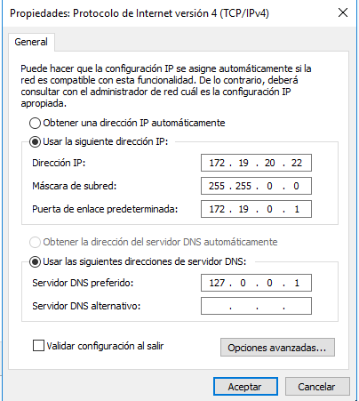

# Configuración de DHCP failover en Windows Server 2016

```
Nombre      : Alejandro de Paz Hernández y Kevin Carballo Torres
Curso       : 2º de Ciclo Superior de Administración de Sistemas Informáticos en Red
```

# 1. Introducción

El objetivo de esta práctica es configurar un servicio DHCP failover (o conmutación por error) con dos máquinas virtuales Windows Server 2016. Esto permitirá que nuestro servicio DHCP siga activo incluso cuando el servidor principal caiga o tenga algún problema, ya que los clientes recurrirán al servidor secundario. De esta forma tendremos un servidor DHCP de alta disponibilidad.

---

# 2. Configuración de failover

- 




## 2.1 Configuración del servicio DHCP


Tras la instalación, tendremos una serie de archivos en `/etc/dhcp/`. Concretamente nos interesa el fichero de configuración `/etc/dhcp/dhcpd.conf`, que es donde crearemos los ámbit