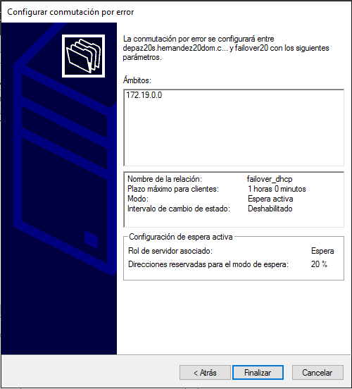
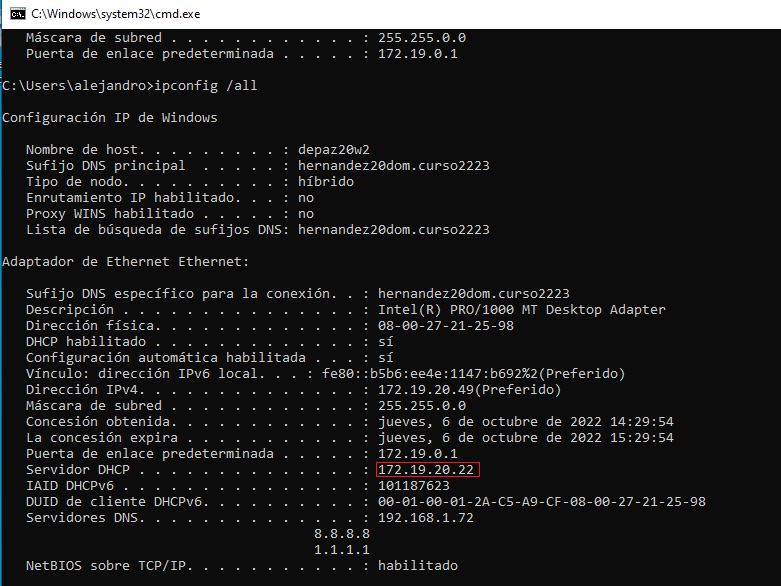

# Configuración de DHCP failover en Windows Server 2016

```
Nombre      : Alejandro de Paz Hernández y Kevin Carballo Torres
Curso       : 2º de Ciclo Superior de Administración de Sistemas Informáticos en Red
```

# 1. Introducción

El objetivo de esta práctica es configurar un servicio DHCP failover (o conmutación por error) con dos máquinas virtuales Windows Server 2016. Esto permitirá que nuestro servicio DHCP siga activo incluso cuando el servidor principal caiga o tenga algún problema, ya que los clientes recurrirán al servidor secundario. De esta forma tendremos un servidor DHCP de alta disponibilidad.

---

# 2. Configuración de failover

- Lo primero es configurar dos MVs Windows Server 2016, cada una con una IP estática distinta pero dentro de la misma red. En nuestro caso usaremos `172.19.20.21` para el servidor principal y `172.19.20.22` para el servidor secundario. Una vez hecho eso, vamos a la configuración del servicio DHCP en el menú `Herramientas` y hacemos lo siguiente: `Click derecho sobre DHCP -> Añadir Equipo -> Añadimos el servidor secundario`:


- A continuación, nos vamos al ámbito sobre el que queremos establecer un failover y hacemos `Click derecho sobre el ámbito -> Configurar conmutación por error`. Esto nos desplegará un asistente para configurarlo.


- Existen dos modos de conmutación por error: espera activa y equilibrio de carga. En el modo de espera activa, el servidor secundario esperará a que el servidor principal deje de funcionar para empezar a funcionar y tomar el rol de este. En el modo de equilibrio de carga los dos servidores reparten IPs simultáneamente, distribuyendo la carga de trabajo en base al porcentaje que nosotros asignemos a cada servidor. Este último modo se suele utilizar cuando ambos servidores se encuentran físicamente en el mismo espacio. Nosotros utilizaremos el modo de espera activa para facilitar las comprobaciones:




- Antes de realizar las comprobaciones, tendremos que habilitar al servidor secundario para que pueda conceder IPs. Para ello `Click derecho sobre el servidor secundario (failover20)-> Autorizar`. En caso de que esto no funcione, tendremos que ir al propio servidor secundario y habilitarlo desde ahí. Si todo está bien configurado veremos un tick verde en ambos ámbitos.


## 2.1 Comprobaciones

- Vamos a la máquina cliente, la ponemos en red interna (misma red interna que los servidores) y configuramos la IP en DHCP. Vemos que si ambos servidores están activos toma la IP del servidor principal:



- Sin embargo, si desactivamos el DHCP del servidor principal, es el servidor secundario el que le concederá la IP:


