# Configuración e instalación de servicio DHCP en Ubuntu

```
Nombre      : Alejandro de Paz Hernández
Curso       : 2º de Ciclo Superior de Administración de Sistemas Informáticos en Red
```

# 1. Introducción

En esta práctica vamos a configurar e instalar el servicio DHCP en una máquina GNU/Linux Ubuntu 20.04.5 LTS. A diferencia de Windows, en Ubuntu tendremos que usar la terminal para realizar tanto la instalación como la configuración del servicio, lo que hace que el proceso sea mucho más rápido.

---

# 2. Instalación del servicio DHCP

- Para instalar el servicio DHCP tendremos que ejecutar el comando `apt install isc-dhcp-server`. El nombre del paquete (*isc-dhcp-server*) puede variar entre las versiones de Ubuntu, por lo que siempre deberemos consultar la documentación oficial.

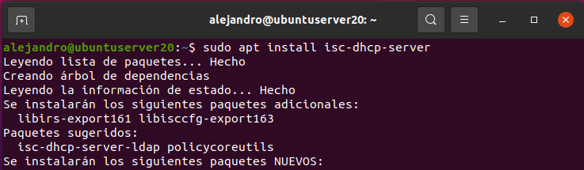

## 2.1 Configuración del servicio DHCP


Tras la instalación, tendremos una serie de archivos en `/etc/dhcp/`. Concretamente nos interesa el fichero de configuración `/etc/dhcp/dhcpd.conf`, que es donde crearemos los ámbitos y estableceremos la configuración deseada.

- Para el primer ámbito, utilizaremos la red `172.19.0.0` con máscara `255.255.0.0`, dado que el servidor tiene la siguiente configuración de red:

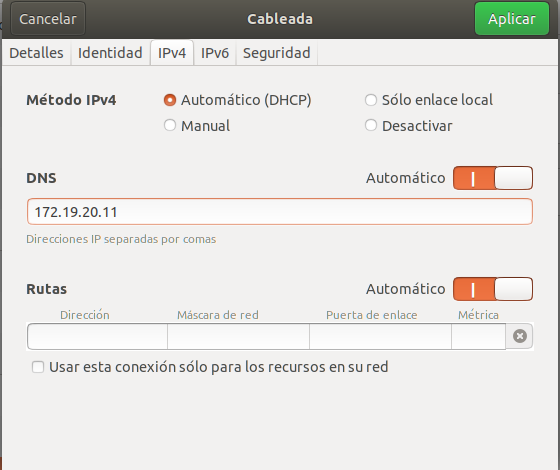

- Creamos el ámbito y establecemos una serie de parámetros, explicados a continuación, en el fichero de configuración `/etc/dhcp/dhcpd.conf`:
    
    - **option-routers**: puerta de enlace o gateway.
    - **option-domain-name-servers**: dns.
    - **range**: rango de direcciones que proporcionará el servidor.
    - **default-lease-time**: tiempo de concesión de una IP cuando el cliente no indica ningún tiempo.
    - **max-lease-time**: tiempo de concesión máximo durante el que se concederá una IP.

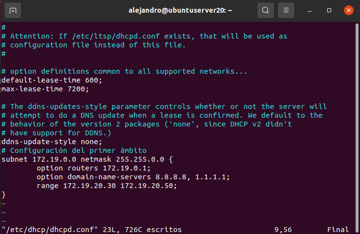

> **Nota**: Algunos de estos parámetros se pueden definir tanto dentro del ámbito como fuera de este, convirténdolos en parámetros globales. En caso de declararlos en ambos sitios, tendrán prioridad los que se encuentren en el ámbito.


- Cada vez que modifiquemos este fichero, tendremos que reiniciar el servicio para que se efectúen los cambios. 

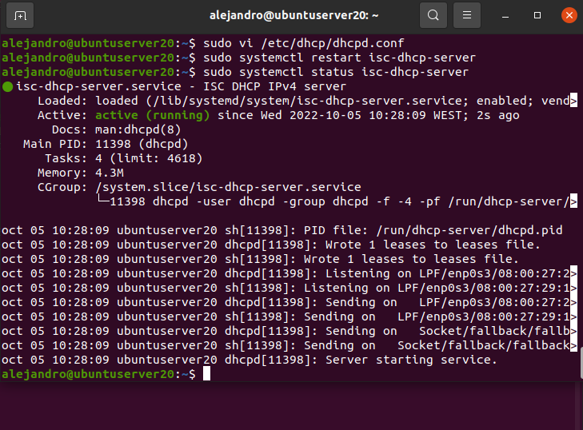

## 2.2 Comprobamos en el cliente

- Vamos al cliente y comprobamos que el servidor DHCP funciona correctamente:

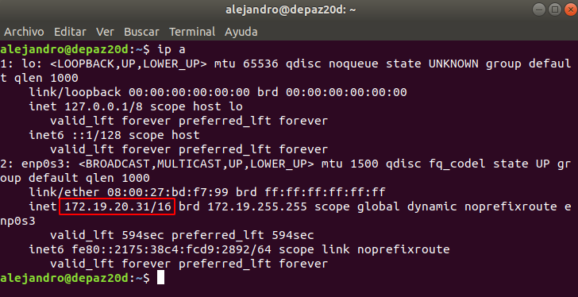

## 2.3 Configuración de una reserva

- Para configurar una reserva, utilizaremos el parámetro `host` seguido del nombre que le queramos dar a dicha reserva:

    - **hardware ethernet**: dirección MAC de la máquina a la que queremos concederle la IP.
    - **fixed-address**: dirección IP que queremos conceder.

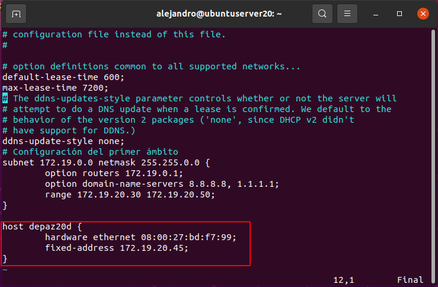

- Al igual que antes, reiniciamos el servicio DHCP y comprobamos en el cliente:

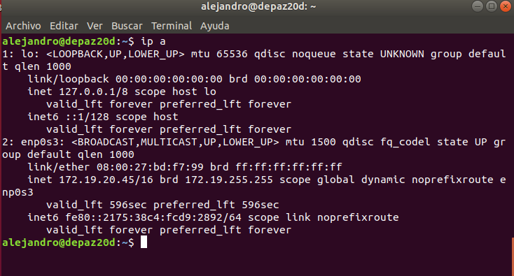

- Si quisiéramos establecer una exclusión, podríamos declarar dos o más `range` dentro el ámbito, dejando fuera las direcciones deseadas ya que no existe un parámetro específico para declarar una exclusión.

## 2.4 Configuración del segundo ámbito

- Para crear un segundo ámbito necesitaremos una segunda tarjeta de red con dirección IP estática:

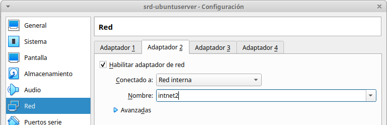

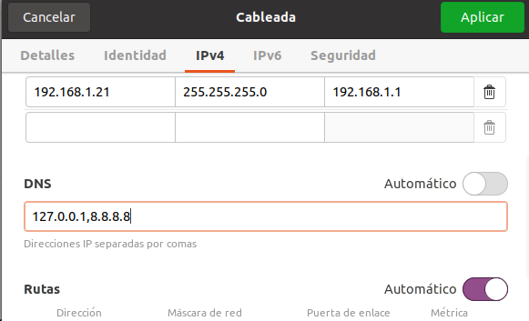

- Una vez hecho eso, simplemente tendremos que ir al archivo de configuración `/etc/dhcp/dhcpd.conf` y añadir el nuevo ámbito. En este caso, hemos añadido un nuevo parámetro:
    - **option broadcast-address**: dirección de broadcast.

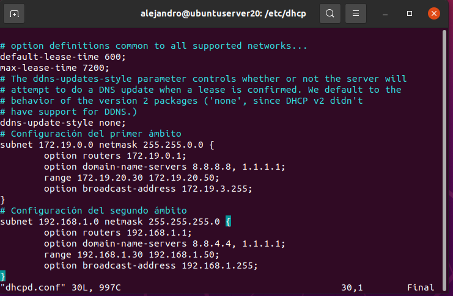

## 2.5 Comprobación en el cliente (2)

- Cambiamos el nombre de la tarjeta de red del cliente y el DNS y comprobamos:

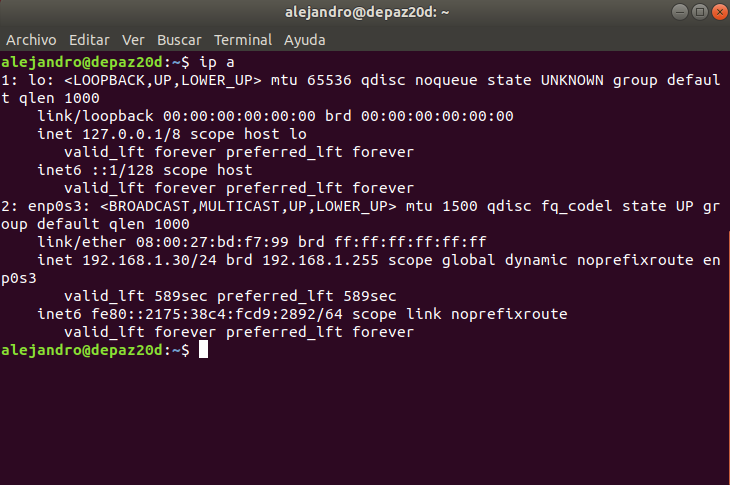

- Vemos que el DNS 8.8.8.8 también se ha añadido a la configuración:

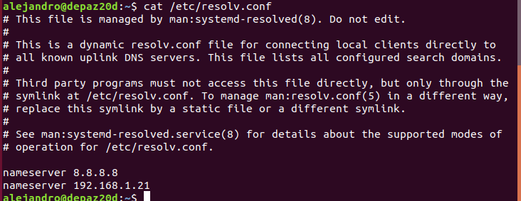

## 3. Superámbito

- Para crear un superámbito lo haremos con el parámetro `shared-network`, dándole un nombre y englobando entre llaves `{}` los ámbitos que queramos incluir:

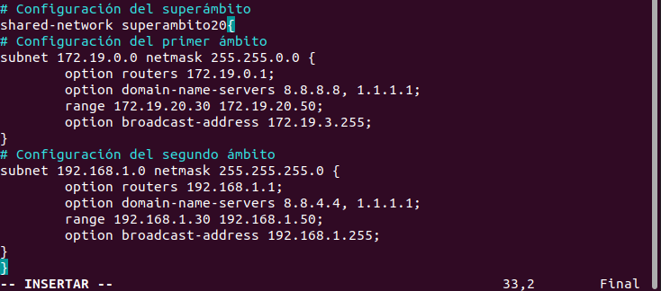