# Instalación y Configuración DNS Linux Bind9

```
Nombre      : Alejandro de Paz Hernández
Curso       : 2º de Ciclo Superior de Administración de Sistemas Informáticos en Red
```

# 1. Introducción

En esta práctica vamos a configurar e instalar el servicio DNS en una máquina GNU/Linux Ubuntu 20.04.5 LTS. Utilizaremos el servicio `bind9`, que es el más utilizado y extendido actualmente.

---

# 2. Instalación del servicio DNS

Para la instalación, instalaremos el siguiente paquete desde la terminal:

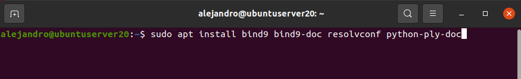

# 3. Servidor DNS caché

> NOTA: hay que editar el fichero `/etc/resolv.conf` y establecer la IP del servidor como DNS.

Una vez instalado el servicio, vamos a configurarlo. Para ello, tendremos que editar los distintos ficheros de configuración que nos proporciona `bind9`. En primer lugar, vamos a establecer los reenviadores en el fichero `/etc/bind/named.conf.options`:

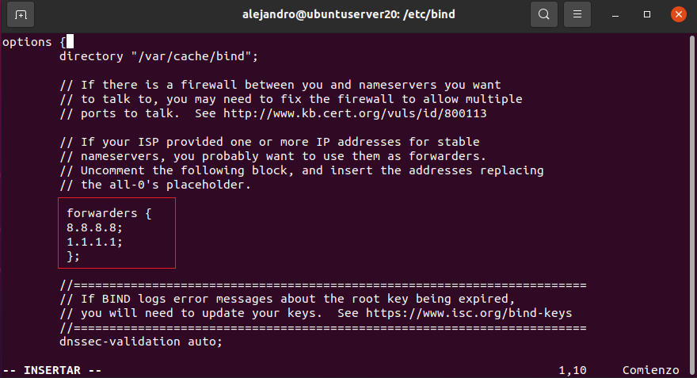

Esto convierte a nuestro servidor DNS en servidor DNS caché. Comprobamos que tanto el cliente como el servidor son capaces de resolver direcciones externas:

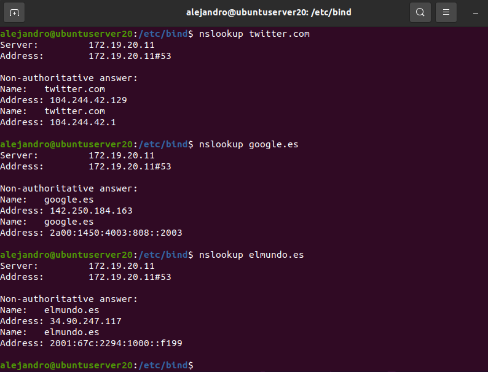

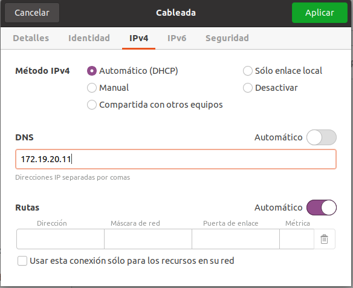

## 3.1 Servidor DNS maestro

Ahora crearemos una zona de búsqueda directa llamada `srd20.com`. Para ello, editamos el fichero `/etc/bind/named.conf.local` y añadimos lo siguiente:

- **zone**: nombre de la zona de búsqueda
- **type**: tipo de zona (maestro, esclavo...)
- **file**: archivo en el que estarán las direcciones de nuestro servidor

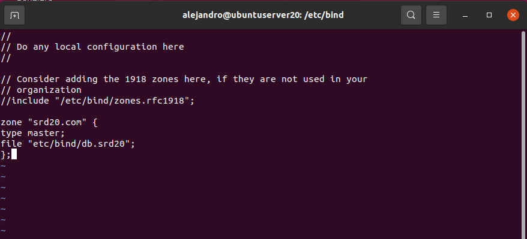

A continuación, creamos y editamos el fichero `/etc/bind/db.srd20`. Para facilitar la configuración, podemos copiar el contenido de `/etc/bind/db.local`:

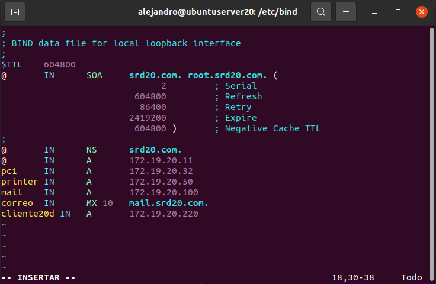

Comprobamos la resolución de nombres tanto desde el servidor como desde el cliente:

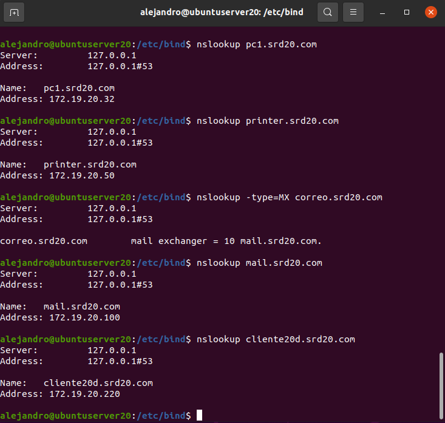

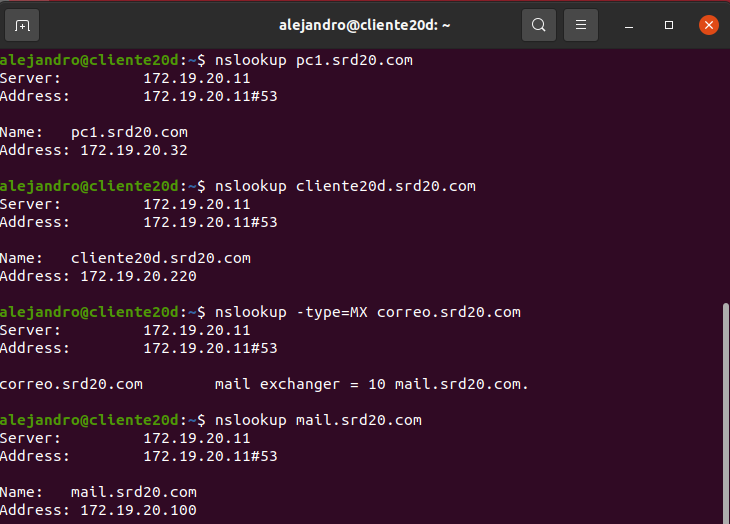

## 3.2 Zona de búsqueda inversa

Vamos a crear una zona de búsqueda inversa. Al igual que con la zona de búsqueda directa, lo primero será editar el fichero `/etc/bind/named.conf.local` y declarar la zona:

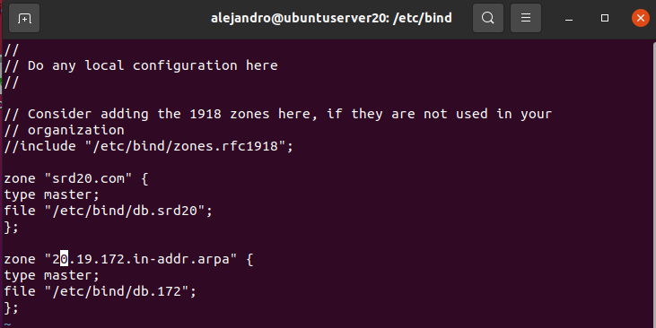

A continuación, creamos y editamos el fichero `/etc/bind/db.172`. Para facilitar la configuración, podemos copiar el contenido de `/etc/bind/db.127`:

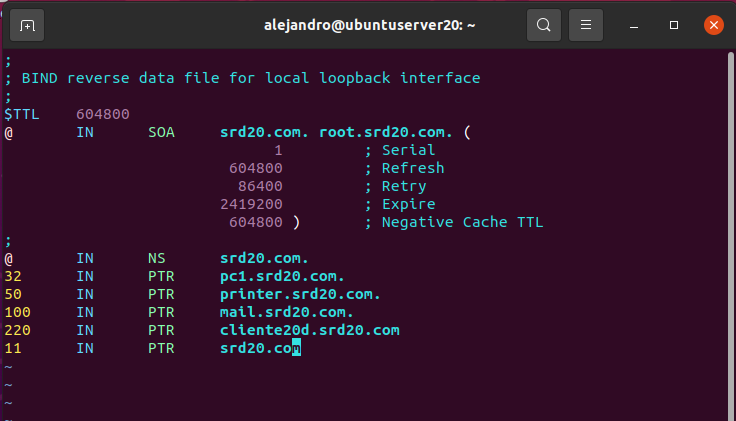

Comprobamos la resolución de las direcciones IP tanto desde el servidor como desde el cliente:

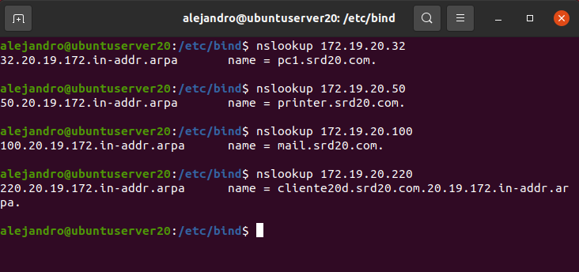

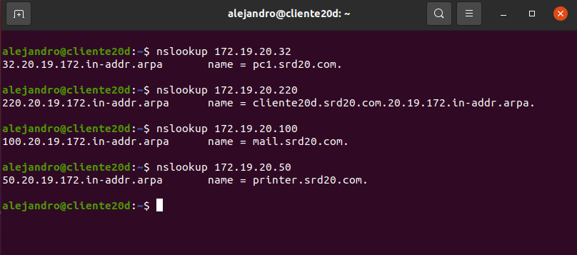

# 4. Servidor DNS esclavo

En este último apartado vamos a hacer que nuestro servidor maestro se convierta en servidor esclavo. Un servidor esclavo es un tipo de servidor que recibe la información necesaria para la resolución de nombres de dominio de un servidor maestro. Esto es especialmente útil para ofrecer alta disponibilidad y repartir la carga de trabajo.

Para configurar nuestro servidor como esclavo, añadiremos lo siguiente en el fichero `/etc/bind/named.conf.local`:

- **masters**: dirección IP del servidor maestro
- **allow-query**: declaramos quién tiene permiso para realizar consultas al servidor

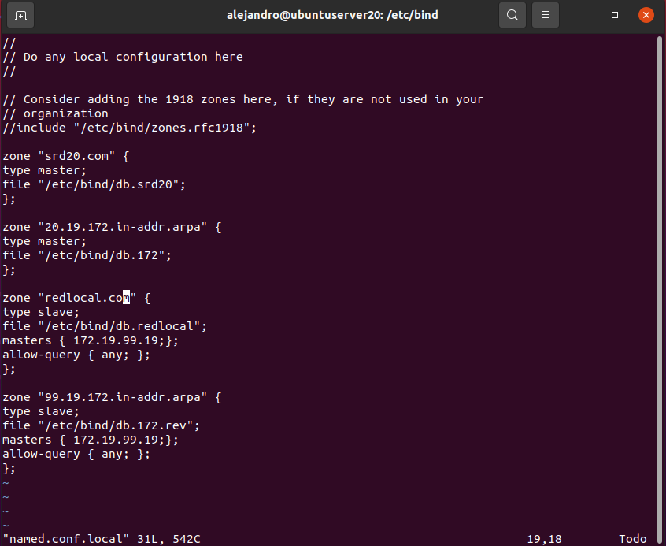

Comprobamos desde el cliente y el propio servidor:

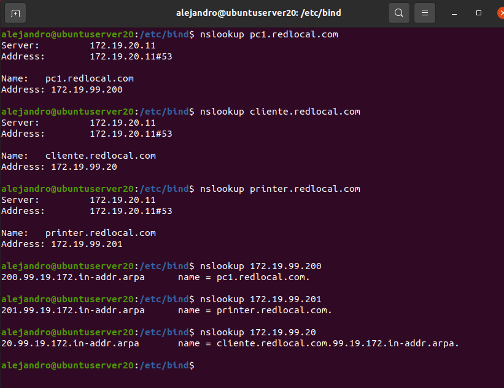

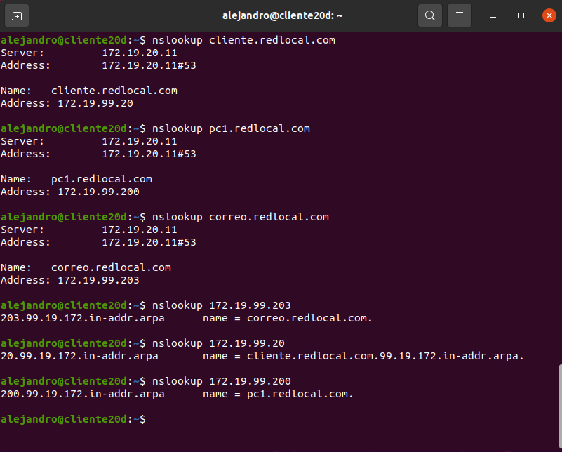