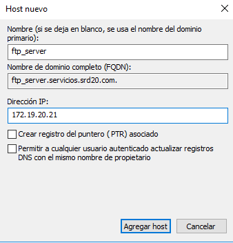

# Instalación y Configuración DNS Windows Server

```
Nombre      : Alejandro de Paz Hernández
Curso       : 2º de Ciclo Superior de Administración de Sistemas Informáticos en Red
```

# 1. Introducción

En esta práctica vamos a configurar e instalar el servicio DNS (Domain Name Server) en nuesta máquina Windows Server 2016. Este servicio se encarga de traducir nombres de dominio en direcciones de IP, de forma que si tenemos un PC con la IP `192.168.1.5` le podemos asignar el nombre `PC1` y acceder a él utilizando dicho nombre.

---

# 2. Instalación del servicio DNS

Por lo general, el servicio DNS se instalará por defecto al instalar el servicio de dominio Active Directory. En caso contrario, vamos a `Administrar el Servidor → Agregar roles y características → Servidor DNS`.

# 3. Servicio DNS

Una vez instalado el servicio, vamos a configurarlo. Para ello, vamos a `Herramientas → Servidor DNS` y creamos una nueva zona de búsqueda directa, que nos permitirá traducir nombres de dominio en IPs. Seleccionamos las opciones por defecto y le damos un nombre:


Ahora añadiremos también una zona de búsqueda inversa, que nos permitirá traducir una dirección IP en un nombre de dominio:


A continuación, configuramos los reenviadores, que son los encargados de resolver los nombres/IPs cuando nuestro servidor DNS no sea capaz de hacerlo:


## 3.1 Servidor DNS caché

Para que nuestro servidor DNS se convierta en servidor DNS caché, tendremos que añadir la IP del propio servidor como DNS. Esto hará que recurra a sí mismo para la resolución de nombres/IPs:


## 3.2 Servidor DNS maestro

Vamos a convertir nuestro servidor DNS en un servidor DNS maestro. Para ello, añadimos los siguientes registros en la zona de búsqueda directa creada anteriormente:

- Un alias para nuestro servidor:


- Una impresora:


- Un servidor de correo. Primero creamos un `registro A` al que asociar dicho correo y luego lo asociamos con un `registro MX`:


Creamos una subzona llamada `servicios` dentro de `srd20.com` y agregamos lo siguiente:


- Un servidor FTP asociado a nuestro servidor:



- Una impresora:


- El PC del administrador:


Nos quedaría la siguiente estructura:


# 4. Comprobación desde el servidor

Vamos a comprobar que los nombres se resuelven correctamente desde la consola del servidor con el comando `nslookup`:


# 4.1 Comprobación desde el cliente

Unimos una máquina cliente al dominio y añadimos a nuestro servidor como servidor DNS principal:


Comprobamos desde terminal:


Comprobamos que también resuelve los nombres de dominio que no están en nuestro servidor, gracias a los reenviadores:


# 5. Delegación de zona DNS

La delegación de zona DNS consiste en hacer que un servidor DNS delegue la autoridad de una parte de su espacio de nombres en uno o más servidores DNS. Para este ejemplo, crearemos una nueva zona de búsqueda directa llamada `servicios.com` en el servidor `carballo21s`. Dentro de esta zona, crearemos un registro de tipo A con la dirección IP del servidor y un alias que apunte a dicho registro:


Una vez creada, repetimos lo anterior en `depaz20s`, pero esta vez la nueva zona se llamará `sub.servicios.com`:


Volvemos al servidor `carballo21s`, hacemos `Click derecho sobre servicios.com → Delegación nueva`:


Le damos el mismo nombre que en el servidor `depaz20s`:


Ponemos el nombre de nuestro servidor delante y al clickar en *resolver* encontrará la IP del servidor `depaz20s` automáticamente. 


Nos quedará lo siguiente:


Comprobamos desde la terminal del servidor `carballo21s`:


Si intentamos comprobar la resolución de nombres desde el servidor `depaz20s` tendremos lo siguiente:


Para que funcione tendremos que añadir el dominio `servicios.com` como reenviador condicional en el servidor `depaz20s`:


Si volvemos a comprobar vemos que ahora sí funciona correctamente:


