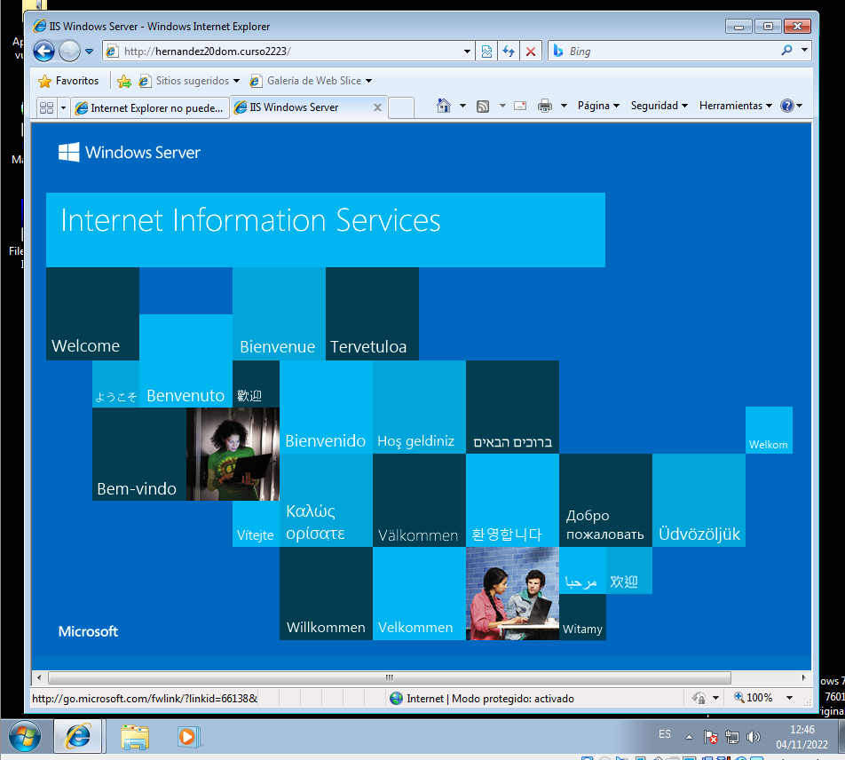
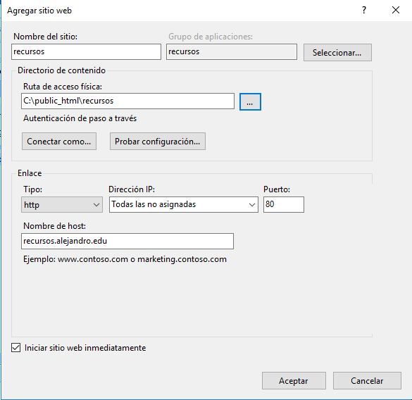

# Windows Server 2016 IIS - Servidor Web básico

```
Nombre      : Alejandro de Paz Hernández

```

# 1. Introducción

En esta práctica vamos a configurar e instalar el servicio Web IIS en una máquina Windows 2016 Server para crear y alojar distintos sitios web.

---

# 2. Instalación del servidor web IIS

Para la instalación, nos vamos a `Agregar roles y características → Servidor Web (IIS)`. Agregaremos también la `Autenticación básica` y la `Autenticación de Windows`:


# 3. Servidor web IIS 

Una vez instalado, comprobamos el acceso a la página web por defecto. Para ello, abrimos un navegador en el servidor e introducimos la dirección IP del servidor:


Comprobamos que también podemos acceder desde un cliente, tanto por IP como por nombre:

> Hay que tener en cuenta que tendremos que poner nuestro servidor como servidor DNS del cliente para que resuelva el nombre




A continuación, vamos a modificar el `C:\Inetpub\wwwroot\index.html` para que la web por defecto nos muestre otra cosa:


Por último, creamos distintos directorios dentro de la ruta `C:\Inetpub\wwwroot\` y añadimos un `index.html` personalizado en cada uno. Al crear los directorios en la ruta física, nos aparecerán automáticamente en el Administrador de sitios web:


Comprobamos el acceso a los distintos directorios, tanto por nombre como por dirección IP y tanto desde el cliente como desde el servidor:


## 3.1 Sitios web independientes

Vamos a crear dos nuevos sitios web independientes. Para ello, vamos a `Herramientas → Administrador de Internet Information Services (IIS)` y creamos un nuevo sitio web llamado `alejandro.edu`:


Para poder acceder a este sitio web, crearemos una nueva zona de búsqueda directa en el DNS con el mismo nombre. Si ahora nos vamos al navegador e introducimos la dirección, vemos lo siguiente:


Y desde el cliente:


A continuación, añadimos `recursos` como nuevo sitio web:



Este nuevo sitio web será un subdominio de `alejandro.edu`, así que para ello tendremos que crear un subdominio dentro de la zona de búsqueda directa creada anteriormente. Nos vamos a un navegador y comprobamos:


El DNS nos quedaría de la siguiente forma:


Y los sitios web:


## 3.2 Directorios virtuales

En este último apartado vamos añadir directorios virtuales al sitio web `alejandro.edu`. Esto nos permitirá acceder a directorios que se encuentren fuera de la dirección física establecida en la creación del sitio web, de forma que podamos acceder a archivos que estén en un disco duro o en cualquier otra parte. Para ello `Click derecho sobre el sitio web → Añadir directorio virtual`:


Una vez creado, habilitamos el `Examen de directorios`. Esto hará que se listen automáticamente los ficheros y directorios cuando accedamos desde el navegador:


Comprobamos accediendo desde el servidor y desde el cliente:


Añadimos un `index.html` a cada departamento y comprobamos:


En nuestro caso, solo tenemos el `index.html`, pero si tuviéramos más archivos podríamos especificar cuál queremos mostrar de forma predeterminada:


