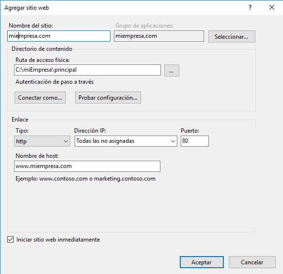
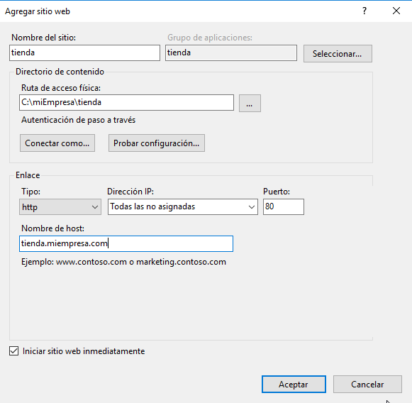

# Windows Server 2016 IIS - Servidor Web básico

```
Nombre      : Alejandro de Paz Hernández
```

# 1. Introducción

En esta práctica vamos a configurar el acceso de forma segura (*https*) a un sitio web y el acceso a carpetas privadas.

---

# 2. Acceso de forma segura (HTTPS) con Certificado Autofirmado

Empezamos creando una nueva zona de búsqueda directa para el sitio web que crearemos más adelante. Lo llamaremos `miempresa.com`:


A continuación, creamos la carpeta `C:\miempresa\principal` donde alojaremos el `index.html` que mostraremos en la página web:


Ahora que hemos realizado la configuración previa, creamos el sitio web:



Vamos a crear un nuevo sitio web como subdominio de `miempresa.com` llamado `pagos`. Para ello, creamos el host `pagos` en el DNS y la carpeta `C:\miempresa\pagos`:


Comprobamos el acceso desde el servidor y desde el cliente, respectivamente:


Como vemos, el acceso es vía *http*. Para configurar un acceso seguro, vamos a `Administrador de IIS → Servidor → Certificados de servidor → Crear certificado autofirmado`:


Ahora que hemos creado el certificado, vamos al sitio web `pagos → Enlaces → Agregar enlace`, seleccionamos el acceso https por el puerto 443 y añadimos el certificado que hemos creado previamente:


Comprobamos el acceso desde el servidor y desde el cliente. En ambos casos, nos saldrá una advertencia a pesar de estar configurado como *https*, ya que el certificado que hemos generado ha sido firmado por nosotros mismos y no por una entidad certificadora. Ignoramos la advertencia y continuamos:


## 2.1 Acceso de forma segura (HTTPS) con OpenSSL

Vamos a ver otra forma de generar el certificado, utilizando el software OpenSSL. 

Primero creamos un nuevo sitio web como subdominio de `miempresa.com` llamado `tienda`, que utilizaremos para configurar el acceso de forma segura:



A continuación, abrimos un terminal y nos movemos a la carpeta `OpenSSL\bin\`. Ejecutamos el siguiente comando, que nos generará una clave privada con la que encriptar el certificado:


Ahora utilizaremos esta clave para generar una solicitud de certificado (.CSR). Ejecutamos el siguiente comando y pedirá rellenar una serie de datos. El campo más importante a rellenar es *Common Name* que será el nombre completo del subdominio:


Para ver el certificado anterior ejecutamos lo siguiente:


Por último, convertimos el archivo `domain.crt` en `domain.pfx` para poder usarlo en nuestro servidor web:


Para añadir el certificado al servidor, nos vamos a `Administrador de IIS → Servidor → Certificados de servidor → Importar` y seleccionamos el archivo `domain.pfx`:


Para finalizar, añadimos el acceso *https* al sitio web `tienda` utilizando el certificado que hemos importado:


Comprobamos el acceso desde el servidor y desde el cliente:


# 3. Acceso a carpetas privadas

Vamos a configurar un nuevo sitio web como subdominio de `miempresa.com` llamado `empleados`, donde alojaremos varias carpetas personales a las que solo podrá entrar el propio empleado y el administrador del servidor.

Creamos el sitio web:


Y las carpetas de cada usuario, además de una carpeta común a la que podrá entrar cualquier usuario registrado:


Lo primero para configurar el acceso será deshabilitar la autenticación anónima de todas las carpetas de `empleados` e instalar la autenticación básica:


Una vez instalada, la habilitamos:


A continuación, creamos los usuarios de cada empleado y el grupo `empleados`, donde estarán dichos usuarios:


Acto seguido, deshabilitamos la herencia de todas las carpetas de `empleados`, incluida la propia carpeta:


Asignamos los permisos para cada carpeta, asignando el grupo `Administradores` y el usuario específico de cada carpeta: 


Para la carpeta `común`, añadiremos el grupo `empleados` para que todos los miembros tengan acceso:


Comprobamos el acceso desde el cliente con el usuario `diego`:


Vemos que nos deja acceder al sitio web, ahora vamos a probar el acceso a su carpeta de datos:


Si probamos a entrar en la carpeta de otro empleado (alejandro, en este caso), pasa lo siguiente:


Nos pide autenticación y nos impide el acceso con el usuario `diego`:


Sin embargo, sí que podemos entrar a la carpeta `común`:


Probamos el acceso con otro usuario a su carpeta personal:


Por último, vamos al servidor y comprobamos el acceso como `Administrador`, que nos permite entrar en la carpeta de cualquier empleado, como por ejemplo `alejandro`:


