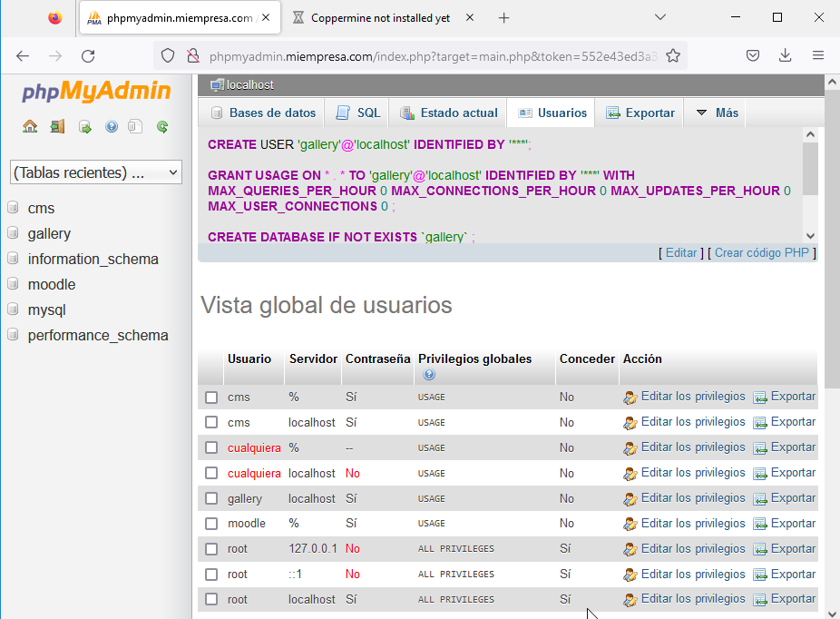

# Servidor Web avanzado - PHP, MySQL, phpMyAdmin, FTP y Drupal

```
Nombre      : Alejandro de Paz Hernández
```

# 1. Introducción

En esta práctica vamos a instalar Drupal y Coppermine en nuestro servidor web, realizando la instalación desde un cliente. Para ello, primero instalaremos las herramientas necesarias para ello: PHP, MySQL, phpMyAdmin y FTP Server/Cliente.

---

# 2. Instalación de PHP

Empezamos descargando PHP. Vamos a descargar la última versión que salió en formato .msi, la 5.3.9:


Es posible que no podamos instalarlo por no tener la característica **CGI** en el servidor web. En ese caso, vamos a `Administrador del servidor → Agregar roles y características → Servidor Web (IIS) → Servidor Web → Desarrollo de aplicaciones → CGI` e instalamos:


Ahora sí, continuamos con la instalación de PHP:


Seleccionamos el fichero **index.php** como documento predeterminado de `miempresa.com` y lo creamos en la ruta física con el siguiente contenido `<?php phpinfo(); ?>`:


Si ahora accedemos a `miempresa.com`, veremos información sobre la versión de PHP que hemos instalado:

* Servidor:


* Cliente:


# 3. Instalación de MySQL y phpMyAdmin

Descargamos la versión de MySQL que sea compatible con la versión de PHP instalada. En este caso, será la 5.6.8.

En el asistente de instalación, seleccionamos **Server only**, para que no nos instale características de más:


Continuamos con la instalación hasta llegar a la siguiente pantalla. Ahí asignamos una contraseña al usuario **root** y creamos un nuevo usuario **alejandro**:


Finalizamos la instalación y pasamos a phpMyAdmin. De nuevo, tendremos que buscar una versión compatible con las versiones de MySQL y PHP que hemos instalado. En este caso, la versión será la 3.5.0. Descargamos el archivo .zip y lo extraemos en `C:\miEmpresa\phpMyAdmin\`:


A continuación, creamos un nuevo sitio web para acceder a phpMyAdmin llamado `phpmyadmin.miempresa.com`:


> Recordar crear un nuevo registro en el DNS.

Probamos el acceso a phpMyAdmin:

* Desde el servidor:


* Desde el cliente:


# 4. Instalación y configuración de FTP

Como servidor FTP utilizaremos **FileZilla** tanto en el cliente como en el servidor. Empezamos descargando e instalando **FileZilla Server**:


Una vez instalado, lo abrimos y nos vamos a `Settings → Rights management → Users → Add`. Creamos un nuevo usuario llamado **ftpuser** y le asignamos la carpeta `C:\miEmpresa\principal`, que es donde instalaremos **Drupal**. De esta forma, podremos pasar ficheros desde el cliente a esa carpeta:


Creamos un nuevo sitio web llamado `ftp.miempresa.com` y comprobamos que el servidor FTP está bien configurado desde el propio servidor:


Por último, nos vamos a la máquina cliente e instalamos **FileZilla Client**:

>NOTA: Para este paso he cambiado el cliente, de Windows 7 a Windows 10, ya que me era imposible instalar FileZilla en el cliente Windows 7.

Una vez instalado, introducimos el nombre o IP del servidor FTP, el usuario y contraseña y el puerto por el que nos vamos a conectar (21 por defecto)


Vemos que todo funciona correctamente y tenemos acceso a la carpeta `C:\miEmpresa\principal\`. Gracias a esto, podremos trabajar desde el cliente a partir de ahora.

# 5. Instalación y configuración de Drupal

Al igual que en las instalaciones anteriores, tendremos que buscar una versión de **Drupal** compatible con las versiones de PHP, MySQL y phpMyAdmin. En este caso, utilizaremos la versión 6.19. Descargamos el .zip y lo extraemos en la máquina cliente. Utilizando el cliente FTP, lo pasamos al servidor, a la carpeta `C:\miEmpresa\principal`:


Ahora nos vamos a phpMyAdmin y creamos la base de datos `cms` y el usuario `cms`, que tendrá todos los privilegios sobre dicha base de datos. Utilizaremos ambos para la instalación de Drupal:


Una vez tenemos todos los requisitos, empezamos con la instalación de Drupal. Para ello, tendremos que cambiar la ruta física de `miempresa.com` y asignarle la carpeta `drupal-6.19`. Tras hacer esto, entramos a `miempresa.com` y veremos lo siguiente:


Hacemos exactamente lo que nos dice el mensaje de error. Nos vamos a la carpeta `C:\miEmpresa\principal\drupal-6.19\sites\default\` y copiamos el fichero `default.settings.php` en la misma carpeta pero con el nombre `settings.php`. A continuación, cambiamos los permisos de `drupal-6.19` y le damos permiso de escritura al grupo `Todos`.

> En este caso le hemos dado permiso de escritura a todos los usuarios ya que es la única forma de que no salte el error.

Introducimos la base de datos y el usuario que hemos creado previamente y continuamos con la instalación:


Nos saltará el siguiente warning por problemas con el servidor de correo. Lo ignoramos y continuamos al sitio web:


Ahora ya tenemos Drupal instalado y solo nos queda configurarlo. Podemos instalar módulos y temas adicionales, para ello nos vamos a `www.drupal.org → Build → Modules` o `www.drupal.org → Build → Themes` y buscamos el complemento que queramos instalar (debe ser una versión compatible con nuestra versión de Drupal):


Una vez encontremos tanto el complemento como la versión, descargamos el .zip, lo extraemos y copiamos en `C:\miEmpresa\principal\drupal-6.19\Modules` (si es un módulo) o `C:\miEmpresa\principal\drupal-6.19\Themes` (si es un tema) a través del cliente FTP:


Si ahora nos vamos a Drupal en `miempresa.com`, podremos encontrar y activar lo que hemos instalado:


Para configurar 

# 5. Instalación y configuración de Coppermine

Para instalar **Coppermine**, repetimos lo que hemos hecho con Drupal. Descargamos el .zip en el cliente, extraemos el contenido y lo pasamos por FTP a la carpeta `C:\miEmpresa\gallery`. Esta carpeta será la ruta de acceso física de nuestro nuevo sitio web `gallery.miempresa.com`:


Creamos la base de datos y el usuario `gallery`, que utilizaremos para la instalación:



Una vez terminados los preparativos, entramos en `gallery.miempresa.com` y realizamos la instalación:


Seleccionamos el usuario y la base de datos:


Creamos un usuario para administrar Coppermine y finalizamos la instalación:


