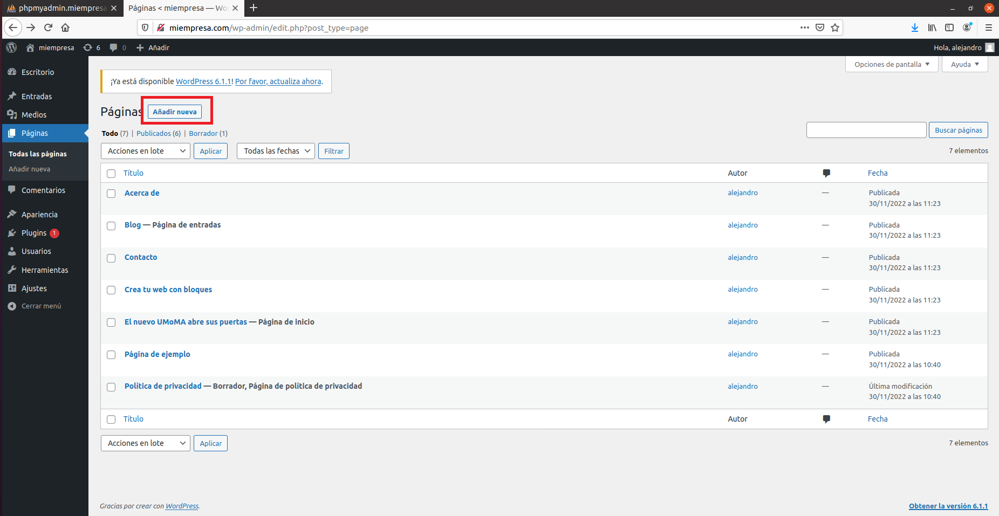

# Servidor Web Apache - Linux

```
Nombre      : Alejandro de Paz Hernández
```

# 1. Introducción

En esta práctica vamos a configurar un servidor web Apache con sitios seguros y carpetas privadas protegidas. También realizaremos la instalación de un CMS, para lo que necesitaremos MySQL, phpMyAdmin y PHP.

---

# 2. Instalación y configuración de Apache

Empezamos instalando el servidor web Apache en una máquina Ubuntu:


Comprobamos el acceso a la carpeta raíz del sitio web por defecto. Comprobamos también el acceso al sitio web desde el navegador:


Modificamos el fichero `/etc/hosts` y añadimos lo siguiente:


> Podríamos hacer lo mismo modificando el servidor DNS y añadiendo un registro para `www.miempresa.com`

Comprobamos el acceso desde un navegador:


Podemos reiniciar o recargar Apache utilizando el siguiente comando:


Comprobamos que existen los ficheros `/var/log/apache2/error.log` y `/var/log/apache2/access.log`:


## 2.1 Configuración de Virtual Hosts

Vamos a crear y configurar dos virtual hosts asociados a `miempresa.com`. El primero será `empleados.miempresa.com`.

### 2.1.1 Sitio web 1 (empleados)

Lo primero será crear la carpeta donde almacenaremos la información que cargará el sitio web, o lo que es lo mismo, la ruta de acceso física. Creamos un `index.html` dentro para comprobar que funciona correctamente al entrar desde el navegador:


A continuación, añadimos el sitio web a `/etc/hosts`:


Creamos el fichero `/etc/apache2/sites-available/empleados.conf` con la siguiente configuración:


Por último, creamos un enlace simbólico al fichero anterior en `/etc/apache2/sites-enabled/`, que nos permitirá habilitar el sitio web y acceder a él:


> También podemos crear el enlace simbólico utilizando el comando `a2ensite` y seleccionando el sitio web que queremos habilitar.

Comprobamos el acceso desde el navegador:


### 2.1.2 Sitio web 2 (pagos)

Para este segundo sitio web vamos a generar un certificado autofirmado para que el acceso sea por **HTTPS**. Para ello, utilizaremos la herramienta **openssl** que se instala por defecto al instalar Apache:

* Generamos una clave privada de 2048 bits y la guardamos en `server.key`. A partir de esa clave, generamos un certificado `server.csr` y rellenamos/omitimos los datos que se nos piden:


* Firmamos dicho certificado nosotros mismos, generando un archivo `server.crt` que nos permitirá crear un sitio web seguro:


A continuación, creamos el directorio `/etc/apache2/ssl` y copiamos los ficheros `server.key` y `server.crt`:


Habilitamos el módulo ssl para Apache y reiniciamos el servicio:


Ahora tendremos que crear el virtual host `pagos.miempresa.com`. Para ello, repetimos el proceso anterior → crear directorio y añadir el sitio web a `/etc/hosts`. Creamos el fichero 
`/etc/apache2/sites-available/pagos.conf` con la siguiente configuración:


Habilitamos el nuevo virtual host y accedemos a él desde el navegador:


Vemos que el navegador nos muestra una advertencia, ya que el certificado ha sido firmado por nosotros mismos. Clickamos en *"Avanzado..."* y continuamos al sitio web:


## 2.2 Carpetas Seguras

Vamos a modificar el sitio web `empleados.miempresa.com` que hemos creado previamente para que solo puedan acceder unos usuarios determinados. También añadiremos un subdirectorio privado para cada usuario, de forma que solo pueda entrar el usuario propietario de ese subdirectorio y el administrador del sitio web.

Lo primero será crear la estructura de subdirectorios dentro de `/var/www/empleados`. Vamos a crear tres carpetas, una para cada empleado:


> Eliminamos también el `index.html`, ya que vamos a listar los contenidos del directorio.

A continuación, tendremos que crear un `.htpasswd` por cada subdirectorio y uno para el sitio web. Cada uno de estos ficheros contendrá las credenciales válidas de acceso. Para entrar al sitio web, crearemos un fichero con el siguiente contenido:


En cambio, para acceder al subdirectorio de un empleado crearemos el siguiente:


Copiamos este último fichero para los usuarios `carla` y `diego`

Una vez creados los ficheros con las credenciales, tendremos que crear un fichero `.htaccess` dentro de `/var/www/empleados` y otro dentro de cada subdirectorio que hayamos creado:

* Fichero `.htaccess` en `/var/www/empleados`:


* Fichero `.htaccess` en `/var/www/empleados/carla` para el usuario **carla** (repetimos para los usuarios/subdirectorios **diego** y **alejandro**):


Comprobamos el acceso al sitio web desde el navegador. Si entramos como **administrador** veremos todos los subdirectorios y tendremos acceso a ellos:


En cambio, si accedemos con el usuario **alejandro**, solo veremos y tendremos acceso al subdirectorio de dicho usuario:


Ocurre lo mismo para el resto de usuarios:


Si intentamos acceder a un subdirectorio que no esté listado, nos volverá a pedir credenciales. Solo podremos acceder con el usuario propietario del subdirectorio o con el usuario **administrador**:


# 3. Instalación de PHP

Instalamos PHP:


Creamos un `index.php` en `/var/www/html` (ruta de acceso física de `www.empleados.com`) y eliminamos el `index.html` que viene por defecto. Incluiremos lo siguiente en dicho fichero: `-<?php phpinfo(); ?>-`. Esto nos mostrará información de la versión de PHP que hemos instalado al acceder al sitio web:


Por último, instalamos el paquete `libapache2-mod-php` que servirá de intérprete de PHP para Apache:


# 4. Instalación de MySQL

Instalamos MySQL Server y el soporte PHP para MySQL con los siguientes comandos:

```
sudo apt-get install mysql-server

sudo apt-get install php-mysql
```
Comprobamos el acceso a MySQL:


# 4. Instalación de phpMyAdmin

Para instalar phpMyAdmin, descargamos la última versión desde la página web oficial y descomprimimos el archivo. Lo haremos en el directorio `/var/www/phpmyadmin`, que será la ruta de acceso física del sitio web `phpmyadmin.miempresa.com`:


A continuación, creamos el virtual host desde el que accederemos a phpmyadmin:


> Hay que añadir también una línea nueva en `/etc/hosts` para `phpmyadmin.miempresa.com`

Comprobamos el acceso desde un navegador al sitio web:


Para poder acceder a phpMyAdmin, primero tendremos que configurar una contraseña para el usuario **root**, que por defecto no tiene contraseña y phpMyAdmin restringe el acceso a usuarios sin contraseña:


Ahora sí, accedemos a phpMyAdmin:


# 5. Instalación y configuración de WordPress

Para finalizar, vamos a instalar y configurar WordPress. Descargamos el .zip de la página oficial de WordPress y lo descomprimimos en `/var/www/wordpress`:


Creamos un nuevo virtual host, donde instalaremos WordPress:


> Añadir también una nueva línea en `/etc/hosts` para `miempresa.com`

Nos vamos a phpMyAdmin y creamos una base de datos y un usuario (con todos los privielgios sobre la base de datos) para WordPress. Una vez hecho eso, entramos en `miempresa.com` desde un navegador y comenzamos la instalación:


Introducimos la base de datos y el usuario que hemos creado:


Es posible que nos aparezca un error como el siguiente:


En ese caso, hacemos lo que nos dice; crear el fichero `/var/www/wordpress/wp-config.php` y copiamos y pegamos el contenido que nos muestran:


Continuamos la instalación. Asignamos un nombre al sitio y creamos un usuario que se encargará de administrar el sitio:


Finalizamos la instalación:


Ahora vamos a configurar una página en WordPress. Para ello, vamos a la pestaña `Páginas` en el panel izquierdo de administración




Añadimos una nueva página y la editamos:


La publicamos y comprobamos el resultado:


También podemos crear nuevas entradas en el blog, desde la pestaña `Entradas`:


