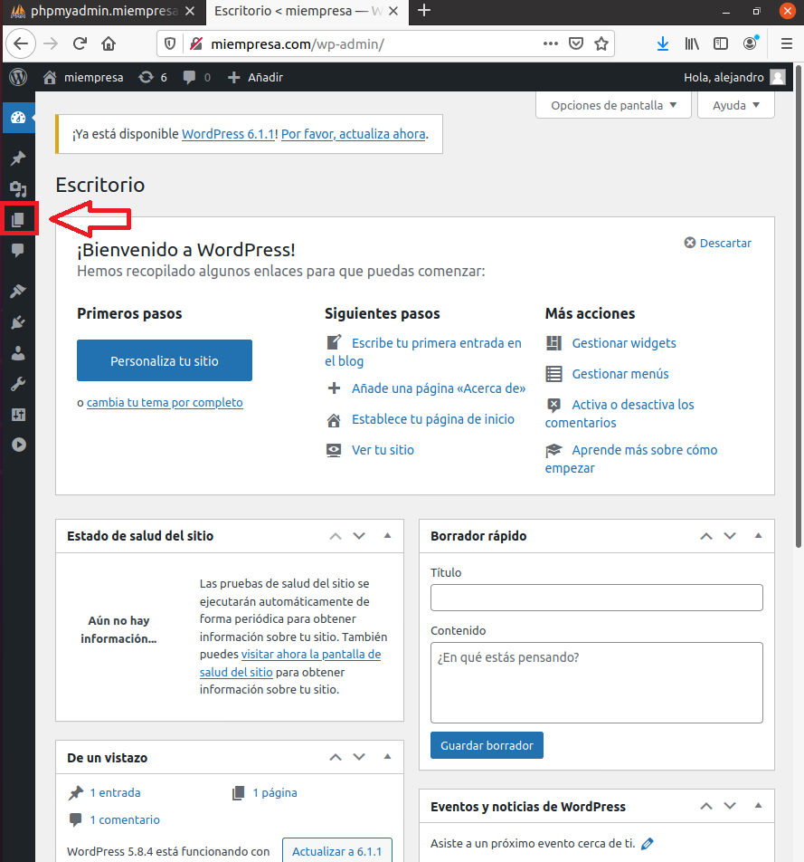

# Servidor Web Apache - Linux

```
Nombre      : Alejandro de Paz Hernández
```

# 1. Introducción

En esta práctica vamos a configurar un servidor web Apache con sitios seguros y carpetas privadas protegidas. También realizaremos la instalación de un CMS, para lo que necesitaremos MySQL, phpMyAdmin y PHP.

---

# 2. Instalación y configuración de Apache

Empezamos instalando el servidor web Apache en una máquina Ubuntu:


Comprobamos el acceso a la carpeta raíz del sitio web por defecto. Comprobamos también el acceso al sitio web desde el navegador:


Modificamos el fichero `/etc/hosts` y añadimos lo siguiente:


> Podríamos hacer lo mismo modificando el servidor DNS y añadiendo un registro para `www.miempresa.com`

Comprobamos el acceso desde un navegador:


Podemos reiniciar o recargar Apache utilizando el siguiente comando:


Comprobamos que existen los ficheros `/var/log/apache2/error.log` y `/var/log/apache2/access.log`:


## 2.1 Configuración de Virtual Hosts

Vamos a crear y configurar dos virtual hosts asociados a `miempresa.com`. El primero será `empleados.miempresa.com`.

### 2.1.1 Sitio web 1 (empleados)

Lo primero será crear la carpeta donde almacenaremos la información que cargará el sitio web, o lo que es lo mismo, la ruta de acceso física. Creamos un `index.html` dentro para comprobar que funciona correctamente al entrar desde el navegador:


A continuación, añadimos el sitio web a `/etc/hosts`:


Creamos el fichero `/etc/apache2/sites-available/empleados.conf` con la siguiente configuración:


Por último, creamos un enlace simbólico al fichero anterior en `/etc/apache2/sites-enabled/`, que nos permitirá habilitar el sitio web y acceder a él:


> También podemos crear el enlace simbólico utilizando el comando `a2ensite` y seleccionando el sitio web que queremos habilitar.

Comprobamos el acceso desde el navegador:


### 2.1.2 Sitio web 2 (pagos)

Para este segundo sitio web vamos a generar un certificado autofirmado para que el acceso sea por **HTTPS**. Para ello, utilizaremos la herramienta **openssl** que se instala por defecto al instalar Apache:

Generamos una clave de 2048 bits.


# 3. Instalación de PHP

Instalamos PHP:


Creamos un `index.php` en `/var/www/html` (ruta de acceso física de `www.empleados.com`) y eliminamos el `index.html` que viene por defecto. Incluiremos lo siguiente en dicho fichero: `-<?php phpinfo(); ?>-`. Esto nos mostrará información de la versión de PHP que hemos instalado al acceder al sitio web:


Por último, instalamos el paquete `libapache2-mod-php` que servirá de intérprete de PHP para Apache:


# 4. Instalación de MySQL

Instalamos MySQL Server y el soporte PHP para MySQL con los siguientes comandos:

```
sudo apt-get install mysql-server

sudo apt-get install php-mysql
```
Comprobamos el acceso a MySQL:


# 4. Instalación de phpMyAdmin

Para instalar phpMyAdmin, descargamos la última versión desde la página web oficial y descomprimimos el archivo. Lo haremos en el directorio `/var/www/phpmyadmin`, que será la ruta de acceso física del sitio web `phpmyadmin.miempresa.com`:


A continuación, creamos el virtual host desde el que accederemos a phpmyadmin:


> Hay que añadir también una línea nueva en `/etc/hosts` para `phpmyadmin.miempresa.com`

Comprobamos el acceso desde un navegador al sitio web:


Para poder acceder a phpMyAdmin, primero tendremos que configurar una contraseña para el usuario **root**, que por defecto no tiene contraseña y phpMyAdmin restringe el acceso a usuarios sin contraseña:


Ahora sí, accedemos a phpMyAdmin:


# 5. Instalación y configuración de WordPress

Para finalizar, vamos a instalar y configurar WordPress. Descargamos el .zip de la página oficial de WordPress y lo descomprimimos en `/var/www/wordpress`:


Creamos un nuevo virtual host, donde instalaremos WordPress:


> Añadir también una nueva línea en `/etc/hosts` para `miempresa.com`

Nos vamos a phpMyAdmin y creamos una base de datos y un usuario (con todos los privielgios sobre la base de datos) para WordPress. Una vez hecho eso, entramos en `miempresa.com` desde un navegador y comenzamos la instalación:


Introducimos la base de datos y el usuario que hemos creado:


Es posible que nos aparezca un error como el siguiente:


En ese caso, hacemos lo que nos dice; crear el fichero `/var/www/wordpress/wp-config.php` y copiamos y pegamos el contenido que nos muestran:


Continuamos la instalación. Asignamos un nombre al sitio y creamos un usuario que se encargará de administrar el sitio:


Finalizamos la instalación:


Ahora vamos a configurar una página en WordPress. Para ello, vamos a la pestaña `Páginas` en el panel izquierdo de administración




Añadimos una nueva página y la editamos:


La publicamos y comprobamos el resultado:

