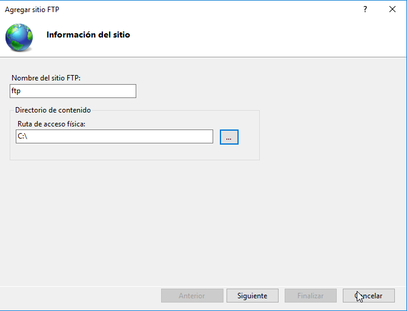
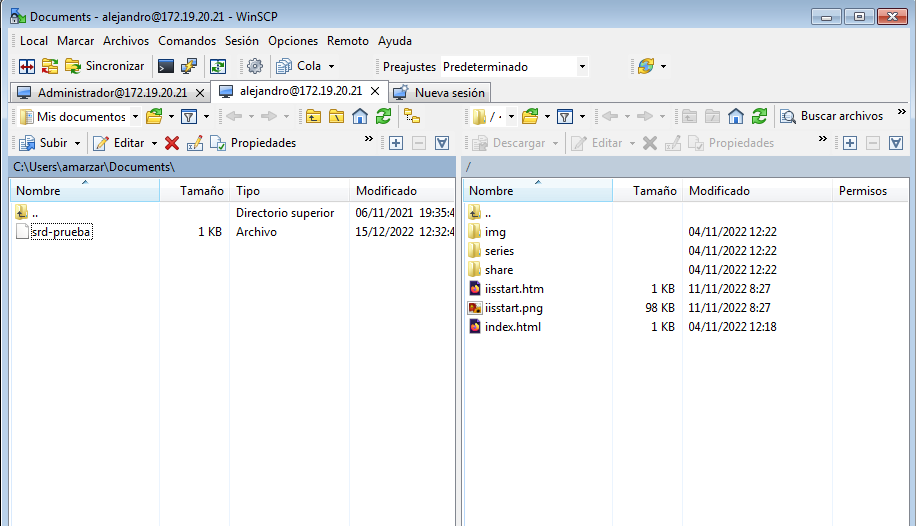
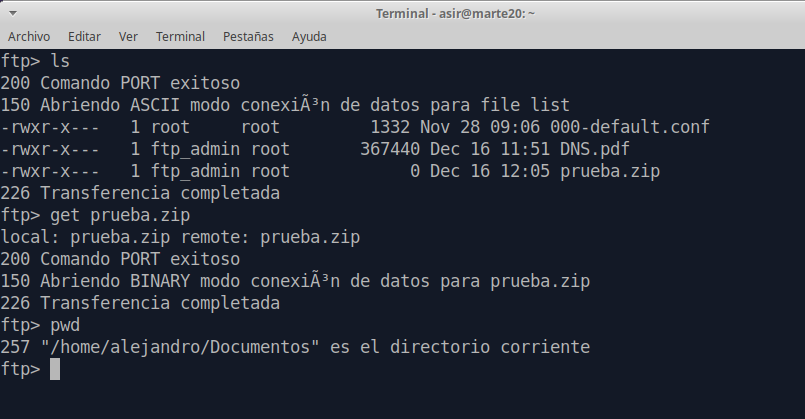

# FTP Server - Windows y Linux

```
Nombre      : Alejandro de Paz Hernández
```

# 1. Introducción

En esta práctica vamos a instalar y configurar varios servidores FTP en Windows Server 2016 y en Ubuntu, comprobando el acceso y las distintas funciones desde un cliente.

---

# 2. Servidor FTP en Windows Server

Empezamos instalando el servidor FTP que nos ofrece el servidor web IIS desde el `Asistente de roles y características` de Windows Server:


## 2.1 Servidor FTP 1

Una vez instalado, vamos a `Herramientas → Administrador de Internet Information Services (IIS) → Agregar sitio FTP`. Seleccionamos el nombre del sitio y le añadimos la ruta de acceso física:



Seleccionamos la IP y el puerto. Lo crearemos sin SSL:


> En caso de error al acceder al servidor FTP a través del navegador, es posible que tengamos que deshabilitar el nombre de host virtual.

Desmarcamos la autenticación anónima y añadimos al usuario **Administrador** como único usuario con acceso al servidor, con permisos de escritura y lectura:


Si nos vamos al sitio FTP que hemos creado, veremos las siguientes opciones:


- **Aislamiento de usuario FTP**: nos permite "encerrar" a cada usuario en la carpeta que queramos.
    
    

- **Autenticación FTP**: nos permite habilitar/deshabilitar la autenticación básica y la anónima.

    

- **Compatibilidad con el firewall**: nos permite configurar el servidor FTP para aceptar conexiones pasivas de un firewall externo.

    

- **Configuración SSL de FTP**: nos permite cambiar la configuración de SSL del servidor.

    

- **Examen de directorios FTP**: nos permite cambiar el estilo en el que se listan los directorios/archivos.

    

- **Filtrado de solicitudes FTP**: nos permite configurar reglas de filtrado para el servicio FTP.

    

- **Mensajes de FTP**: nos permite configurar un mensaje predeterminado que aparecerá al conectar con el servidor FTP.

    

- **Registro FTP**: nos permite configurar la ruta en la que se guardan los ficheros **.log**.

    

- **Reglas de autorización FTP**: nos permite añadir usuarios y cambiar los permisos de estos sobre el servidor FTP.

    

- **Restricciones de direcciones IP y dominios de FTP**: nos permite restringir determinadas IPs y dominios para que no puedan acceder al servidor FTP.

    

- **Sesiones actuales FTP**: nos muestra las sesiones abiertas con nuestro servidor FTP.

    

Accedemos a través del navegador del servidor:


A través del explorador de archivos del servidor:


Probamos a subir un archivo desde el escritorio a `C:`:


Hacemos lo mismo desde el cliente. Primero desde el navegador:


Y desde el explorador de archivos:


Comprobamos que tenemos acceso a algunas de las carpetas:


Y probamos a descargar el archivo `prueba.txt`:


A continuación, vamos a instalar `WinSCP`, un cliente STFP, en nuestra máquina cliente Windows 7. Realizamos la instalación dejando todas las opciones por defecto:


Iniciamos el programa y probamos la conexión a nuestro servidor FTP:


Probamos la subida de archivos, pasando el archivo `srd-prueba.txt` a `C:/Users/Administrador/Documents/`:


## 2.2 Servidor FTP 2

Vamos a crear un segundo servidor FTP que tenga como ruta de acceso física `C:\inetpub\wwwroot`:


Para poder tener activos los dos servidores FTP a la vez y no tener problemas, le asignaremos un puerto distinto a este segundo servidor. En este caso, utilizaremos el puerto `8080`. También podríamos solucionar esto utilizando los nombres de host virtuales, sin embargo, al habilitar esta opción, el servidor IIS da problemas y no permite el acceso por IP siquiera. Para este segundo servidor permitiremos el uso de certifiado SSL:


Deshabilitamos la autentiación anónima y le damos acceso a todos los usuarios de **Active Directory** o, lo que es lo mismo, a todos los usuarios del servidor con permisos de lectura y escritura:


Comprobamos el acceso desde el navegador del servidor con el usuario **diego**:


Y con el usuario **alejandro**:


Si intentamos entrar con un usuario que no pertenece al dominio, no nos dejará:


Probamos el acceso desde el explorador de archivos del servidor con el usuario **carla**:


Por último, probamos el acceso desde el cliente a través de `WinSCP`:




Y pasamos el archivo `srd-prueba.txt`:


Comprobamos que también podemos descargar archivos, descargando `index.html`:


> En caso de error al subir o descargar archivos tendremos que revisar los permisos sobre la carpeta `wwwroot` y asegurarnos de que los usuarios con los que estamos accediendo tienen permiso de **escritura** y **lectura** sobre dicha carpeta.

## 2.3 Servidor FTP 3

Vamos a crear un tercer y último servidor FTP. En este caso, le daremos como ruta de acceso física la carpeta de descargas del usuario **Administrador**:


Al igual que antes, cambiaremos el puerto para que no haya interferencias con los otros dos servidores FTP. Esta vez utilizaremos el puerto 8000:


En este caso, vamos a permitir la autenticación anónima. Tendrán acceso todos los usuarios del servidor con permiso de solo lectura:


> En caso de error al acceder, tendremos que asegurarnos que el grupo **Todos** tiene permiso de lectura sobre la carpeta `C:\Users\Administradpr\Downloads`

Probamos el acceso desde el navegador y desde el explorador de archivos del servidor:


En ambos casos se logueará con el usuario **Anónimo** de forma predeterminada.

Nos vamos al cliente y comprobamos el acceso a través de `WinSCP`:


Si intentamos subir un archivo, nos mostrará un error:


Sin embargo, sí que podemos descargar, por ejemplo, el archivo `phpMyAdmin.zip`:


# 3. Servidor FTP en Ubuntu

# 3.1 SSH

Lo primero es asegurarnos de tener instalado el servicio `SSH` tanto en el servidor como en el cliente. Por lo general, estará instalado por defecto. En caso contrario, lo instalamos con `apt-get install ssh`.

A continuación, creamos dos usuarios con distintos privilegios. El primero, **ftp_admin**, pertenecerá al grupo **sudoers** y tendrá privilegios de **root**. El segundo, **ftp_user**, será un usuario más del sistema, sin privilegios especiales:


Añadimos a **ftp_admin** al grupo sudoers:


Cambiamos también el intérprete de terminal de ambos usuarios, de `sh` a `bash` en el fichero `/etc/passwd`:


Comprobamos el acceso por SSH desde un cliente con ambos usuarios:


Probamos la ejecución de una aplicación gráfica a través de SSH desde el cliente. Para ello, añadimos la opción `-X` al comando `ssh`:


> En caso de error, hay que comprobar que la opción `X11Forwarding yes` esté en el fichero de configuración `/etc/ssh/sshd_config`. También tenemos que asegurarnos de que el programa `xauth` esté instalado en el servidor. Otro posible error es que hayamos creado los usuarios sin directorio `/home`.

# 3.2 Servidor FTP

Vamos a comprobar el acceso al servidor FTP mediante SFTP desde el cliente. Lo haremos con el usuario **ftp_admin** primero:


Probamos la descarga de archivos, descargando tres ficheros de prueba de `/home/ftp_admin/Documentos` :


Y la subida de archivos, subiendo un pdf a `/home/alejandro/Documentos`:


A continuación, accedemos con el usuario **ftp_user**:


Si intentamos listar/leer el directorio `/home/alejandro/` vemos que no tenemos permiso para ello. El único directorio sobre el que puede trabajar el usuario **ftp_user** es sobre su propio directorio `/home`. Podemos descargar archivos:


Y subirlos:


# 3.3 SCP

También podemos hacer uso del comando `scp` para la subida de archivos. Vamos a subir el archivo `prueba.zip` a `/home/alejandro/Documentos` con el usuario **ftp_admin**:


Si intentamos hacer lo mismo con el usuario **ftp_user**, nos dará error por falta de permisos. Al igual que antes, solo podremos subir archivos al directorio `/home/ftp_user`:


# 3.3 PROFTPD

Para finalizar, vamos a instalar el paquete `proftpd` → `apt-get install proftpd`, un servidor FTP de código abierto. Una vez instalado, descomentamos la línea `DefaultRoot` del fichero de configuración `/etc/proftpd.conf`. Esto hará los usuarios ese encuentren en su directorio `/home` al entrar al servidor FTP.

Comprobamos el acceso desde la máquina servidor:


Y desde el cliente:


Probamos la descarga de un archivo con el usuario **ftp_admin** sobre `/home/alejandro/Documentos`:




Y probamos también la subida de archivos, subiendo el fichero `prueba.zip` a `/home/alejandro/Documentos`:


Vamos a entrar ahora con el usuario **ftp_user**:


Si intentamos entrar al directorio `/home/alejandro` dará error:


Al igual que antes, sólo podemos realizar operaciones sobre el directorio `/home` de **ftp_user**:


