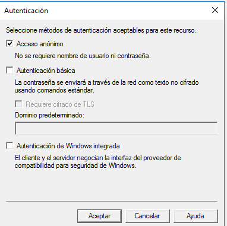

# Servidor de Correo - Windows 2016 Server

```
Nombre      : Alejandro de Paz Hernández
```

# 1. Introducción

Vamos a instalar y configurar dos servicios de correo en una máquina Windows 2016 Server. Primero, instalaremos el servicio SMTP que viene de forma nativa en Windows a través del administrador de aplicaciones (IIS) 6.0. Una vez hayamos configurado y probado este servicio de correo, instalaremos hMailServer; un servidor de correo de código abierto que nos ofrece más posibilidades y un mejor funcionamiento

---

# 2. Servicio SMTP

Instalamos el servicio SMTP, para ello `Administrador del servidor → Agregar roles y características`:


Una vez instalado, vamos a `Herramientas → Administrador de Internet Information Services (IIS) 6.0` para acceder a la configuración del servicio. Abrimos la pestaña de propiedades y configuramos lo siguiente:

* Establecemos como IP todas las no asignadas y limitamos el número de conexiones a 50:


* Habilitamos el registro en formate W3C, diario y en una carpeta concreta:


* Habilitamos el acceso anónimo:



* Aplicamos los cambios y reiniciamos el servicio.

* Accedemos a la sección de `Dominios` y comprobamos que existe el dominio predeterminado:


* Creamos un nuevo dominio de tipo alias:


* Modificamos el DNS, añadiendo una nueva zona y los siguientes registros:


* Comprobamos la existencia de las carpetas de correo creadas en `C:\Inetpub\mailroot`:


Vamos al cliente Windows y comprobamos el acceso a los registros que hemos creado en el DNS:


Descargamos el cliente de correo Thunderbird y añadimos cuentas de correo asociadas a nuestro dominio:


Al intentar añadirlo nos aparecerán varias advertencias de seguridad, las ignoramos y continuamos:


Vemos que la cuenta se crea correctamente:


Habilitamos la autenticación básica desde el servidor y añadimos dos nuevos usuarios; uno anónimo (usuarioprueba) y otro que pertenezca a Active Directory (diego):


Probamos a enviar un correo de alejandro a diego:


Nos vamos al servidor y comprobamos las carpetas `C:\Inetpub\mailroot`. Dentro de `Drop` veremos el correo que hemos enviado:


Repetimos lo mismo para el usuario anónimo:


# 3. hMailServer

Desinstalamos el servicio SMTP que hemos agregado previamente e instalamos hMailServer. Dejamos las opciones por defecto y finalizamos la instalación:


Una vez finalizada, empezamos a configurar el servidor:

* Agregamos una contraseña para entrar al servidor:


* Añadimos dos nuevos dominios (`Domains → Add`) que se llamarán **asir.edu** y **srd.edu**:


* Si ejecutamos un diágnostico sobre los dominios que hemos creado, veremos que nos aparecen dos errores: uno de backup y otro de registro MX. El primero lo solucionamos asignando una carpeta donde guardar las copias de seguridad en `Utilities → Backup`:


Para el segundo, creamos dos nuevas zonas de búsqueda directa (srd.edu y asir.edu) y añadimos los siguientes hosts:


Si ahora realizamos los diagnósticos vemos que no hay ningún error:


* Añadimos dos cuentas en cada dominio. Para la primera, **ricky@asir.edu**, habilitamos la firma y el mensaje de autorespuesta:


Para la segunda, **john@asir.edu**, habilitamos el reenvío/redirección de correo hacia ricky@asir.edu:


Añadimos las cuentas restantes:


Dentro de hMailServer tenemos varias opciones de configuración:

* Podemos elegir los protocolos que vamos a permitir/utilizar en nuestro servidor:


* Podemos crear un filtro anti-spam. También tenemos integrado el software de SpamAssassin, que nos permite marcar como spam los mensajes de cierto host concreto:


* Dentro de las opciones avanzadas, podemos auto banear a un cliente después de varios intentos de inicio de sesión fallidos. Existe también la posibilidad de bloquear rangos de IP's, establecer certificados SSL...:


Nos vamos al cliente Windows y configuramos las cuentas en Thunderbird. Tenemos que seleccionar la configuración **POP3**, ya que **IMAP** dará error:


Repetimos lo mismo para todas las cuentas y probamos el envío y recepción de mensajes:

* De `john@asir.edu` a `jason@srd.edu`:


* De `john@asir.edu` a `ray@srd.edu`:


* Si enviamos un correo a `john@asir.edu`, en este caso desde `jason@srd.edu`, el correo se reenviará directamente a `ricky@asir.edu` y esta a su vez mandará un correo de autorespuesta:
    
    * Reenvío automático: 

    

    * Respuesta automática:

    

    

* Por último, creamos una lista de distribución. Esto nos permitirá enviar un mismo correo a varias personas utilizando una sola dirección de correo:


Añadimos como miembros a los dos usuarios de asir.edu (ricky y john). Para realizar las comprobaciones, marcamos la casilla `Keep original message` en las opciones de reenvío de john. De esta forma el mensaje se reenviará pero también aparecerá en su bandeja de entrada:


Enviamos un correo a `empleados@asir.edu` y comprobamos:


    


