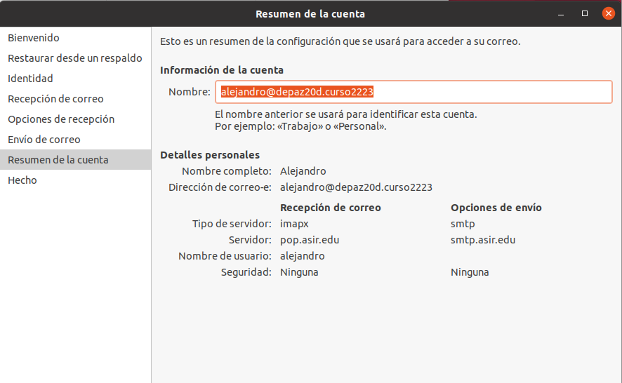

# Servidor de Correo - GNU/Linux Ubuntu 22.04

```
Alejandro de Paz Hernández
```

# 1. Introducción

Vamos a instalar y configurar un servidor de correo en una máquina Ubuntu 22.04. Para ello, instalaremos los servicios **SMTP**, **IMAP** y **POP3** y probaremos su funcionamiento desde una máquina cliente.

---

# 2. Servicio SMTP

Para el servicio SMTP utilizaremos el servidor de correo **Postfix**, un software libre de código abierto. 

* Lo instalamos con `apt-get install postfix`. Durante la instalación, escogemos **Sitio de Internet** y establecemos el nombre de nuestro dominio:


* Comprobamos que el servicio SMTP está activo y a la escucha:


* Realizamos una prueba de envío de mensaje entre dos usuarios del sistema utilizando telnet en el servidor: 


* Una vez enviado, comprobamos la carpeta `/var/spool/mail/` del destinatario:


Ahora que hemos visto que funciona desde el servidor, vamos a probar desde un cliente.

* Instalamos el cliente de correo eléctronico **Evolution** con `apt-get install evolution`

* Añadimos las entradas **smtp.asir.edu** y **pop.asir.edu** en `/etc/hosts` apuntando a la IP del servidor:


* Añadimos una cuenta de correo. A pesar de no tener servicio IMAP activo, lo seleccionamos y continuamos con la configuración:




* Repetimos el proceso para las otras dos cuentas restantes:


* Vemos que las cuentas se han añadido correctamente:


* Probamos el envío y recepción de mensajes:

    * De **alejandro@depaz20d.curso2223** a **ricky@depaz20d.curso2223**:

    

    
    
    * De **ricky@depaz20d.curso2223** a **john@depaz20d.curso2223**:
    
    

    

    * De **john@depaz20d.curso2223** a **alejandro@depaz20d.curso2223**:
    
    

    

# 2.1. Servicio IMAP y servidor SquirrelMail

A continuación, vamos a instalar el servicio IMAP. Este servicio nos permitirá recibir los correos en el cliente, de forma que no tendremos que recurrir al servidor para visualizar el contenido de los mensajes. Utilizaremos **dovecot** → `apt-get install dovecot-imapd`. Comprobamos que el servicio IMAP está activo y a la escucha:


Una vez tengamos el servicio IMAP, vamos a instalar el servidor web **Squirrelmail**, que nos permitirá iniciar sesión y gestionar nuestro correo desde un navegador.

* Descargamos el .zip en `/tmp`y lo descomprimimos:
```
cd /tmp

wget http://downloads.sourceforge.net/project/squirrelmail/stable/1.4.22/squirrelmail-webmail-1.4.22.zip

unzip squirrelmail-webmail-1.4.22.zip

```
* Movemos el directorio y los ficheros a `/var/www/html/`. Le asignamos los permisos necesarios y cambiamos el propietario para que Apache pueda acceder a los ficheros. Finalmente, renombramos el directorio:


* Para configurar **Squirrelmail** utilizaremos el script contenido en `/var/www/html/squirrelmail/config/conf.pl` ejecutando `perl conf.pl`. Esto nos abrirá un menú en terminal desde el que crear el archivo de configuración:

    * Seleccionamos la opción **2. Server Settings**:

    

    * Dentro, seleccionamos la opción **1. Domain** y establecemos el nombre de nuestro dominio (debe coincidir con el que establecimos en **Postfix**):

    

    * Volvemos al menú principal y seleccionamos **4. General Options**:

    

    * Dentro de este nuevo menú, cambiamos las opciones **1. Data Directory**, **2. Attachment Directory** y **11. Allow server-side sorting**:

    

* Creamos un virtualhost en Apache llamado `squirrelmail.edu`, con el directorio `/var/www/html/squirrelmail` como root y entramos desde un navegador:


> En caso de error, comprobar que tenemos PHP y Apache instalado y funcionando correctamente.

Vamos al cliente ahora:

> Para que funcione sin configurar el DNS, añadimos **squirrelmail.edu** a `/etc/hosts` apuntando a la IP del servidor.

* Iniciamos sesión con el usuario **Ricky** y enviamos un correo de prueba a **alejandro@depaz20d.curso2223**:


* Iniciamos sesión con el usuario **alejandro** y comprobamos la bandeja de entrada y el servidor:


* Enviamos un mismo mensaje a **john@depaz20d.curso2223** y **ricky@depaz20d.curso2223**:


* Comprobamos que el mensaje ha llegado tanto por Squirrelmail como por el servidor:


# 2.2. Servicio POP3

Por último, vamos a instalar el servicio POP3. Este servicio descarga todos los mensajes del servidor al que se conecta y los almacena en el cliente de forma local, eliminándolos del servidor.

Utilizaremos **dovecot**, al igual que en el caso anterior, pero esta vez instalaremos el paquete pop3d → `apt-get install dovecot-pop3d`. Comprobamos que el servicio está activo y a la escucha:


Ahora nos vamos al cliente:

* Utilizaremos el cliente de correo **Evolut** una vez más. Eliminamos las cuentas creadas anteriormente y las volvemos a añadir, pero esta vez utilizaremos el servidor POP3 como receptor de correo. Repetimos el procedimiento para todas las cuentas:


* Enviamos un mensaje de prueba de **alejandro@depaz20d.curso2223** a **ricky@depaz20d.curso2223**:


* Comprobamos en el cliente de correo:


* Sin embargo, si vamos al servidor vemos que en la carpeta `/var/spool/mail/ricky` no hay nada:


* Enviamos otro mensaje, esta vez de **ricky@depaz20d.curso2223** a **alejandro@depaz20d.curso2223**:


* Observamos que ocurre lo mismo:


