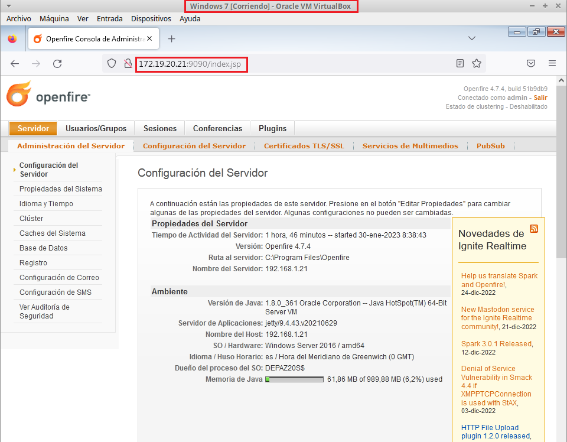

# Mensajería Instantánea - Windows Server 2016

```
Alejandro de Paz Hernández
```

# 1. Introducción

Vamos a instalar y configurar un servidor de mensajería instantánea, que nos permitirá establecer comunicación en tiempo real entre dos o más usuarios en formato texto. Para ello, utilizaremos el software **OpenFire** y **Spark**.

---

# 2. OpenFire

Lo primero será descargar e instalar **[OpenFire](https://www.igniterealtime.org/downloads/)**, un servidor de mensajería instantánea de código abierto. Ejecutamos el .exe y una vez finalizado vamos a un navegador y accedemos a `http://localhost:9090`. Esto nos abrirá un script de instalación. Durante la instalación, tendremos que seleccionar una fuente de datos. Podemos crear nuestra propia base de datos, para lo que necesitaremos tener instalado MySQL, phpMyAdmin y PHP. En este caso, hemos elegido la opción **Base de datos interna** para facilitar el proceso. En la sección de configuración del perfil, seleccionaremos **Servidor de Directorio (LDAP)**. Antes de finalizar la instalación, introducimos un e-mail (puede ser ficticio) y una contraseña.


Si ahora volvemos a acceder a la url `http://localhost:9090` nos aparecerá una ventana de login. Para acceder, utilizaremos el usuario `admin` y la contraseña establecida en el paso anterior. Una vez dentro, tendremos acceso al panel de administración del servidor OpenFire. Además, podemos acceder tanto desde la máquina servidor como desde un cliente:





# 3. Spark

Ya hemos instalado el servidor de mensajería instantánea. Ahora tendremos que instalar un cliente de mensajería instantánea, que en este caso será **Spark**. Esto nos permitirá establecer comunicación entre los distintos usuarios que crearemos en **OpenFire**. Lo instalaremos tanto en el servidor como en el cliente. Descargamos el .exe de la [página oficial](https://www.igniterealtime.org/downloads/) y lo ejecutamos:


A continuación, creamos dos usuarios desde **OpenFire** (`Usuario/Grupos → Crear Nuevo Usuario`):


Si ahora intentamos acceder a **Spark** con alguno de estos usuarios, nos aparecerá un error de certificado:


Para solucionarlo, desde la ventana de login nos vamos a `Avanzado → Security → Encryption mode → Disabled`. Esto hará que no se compruebe el certificado SSL del servidor y nos permitirá iniciar sesión:


Hacemos lo mismo desde el cliente e iniciamos sesión con otro usuario:


Con el usuario **ricky**, introducimos el usuario **alejandro** en la barra de búsqueda para empezar una conversación:


Podemos agregar al otro usuario a nuestra lista de contactos, para no tener que utilizar la barra de búsqueda:


También podemos crear salas de conferencia e invitar a varios usuarios:


También podemos transferir archivos, pero para ello necesitaremos activar la transferencia de archivos desde el servidor **OpenFire** e instalar el plugin **HTTP File Upload**
