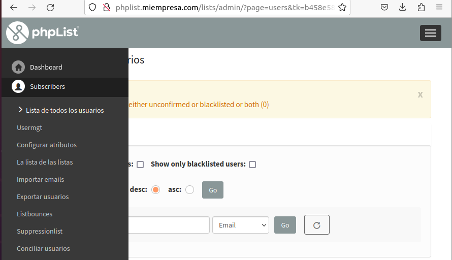
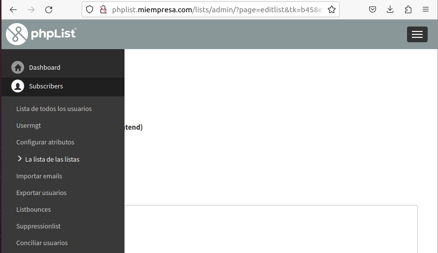
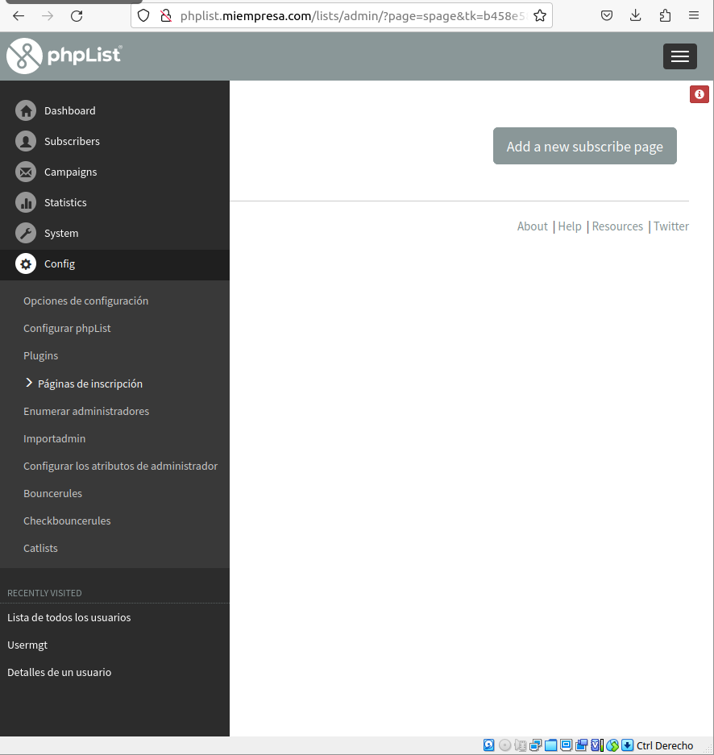

# Listas de Distribución - Ubuntu 18.04

```
Alejandro de Paz Hernández
```

# 1. Introducción

Vamos a instalar y configurar un servicio de gestión de listas de distribución utilizando **phpList**. Este software de código abierto nos permite gestionar listas de suscriptores y enviar boletines informativos, noticias, publicidad y todo tipo de información a través de correos electrónicos, permitiéndonos, además, automatizar el proceso.

---

# 2. phpList

> Para poder realizar la instalación de phpList, primero tendremos que tener instalado Apache, php y MySQL. 

Descargamos el .zip de la página oficial de **[phplist](https://www.phplist.org/download-phplist/)** y lo descomprimimos en `/var/www/`. A continuación, creamos una base de datos y un usuario con todos los privilegios sobre esta:


Una vez creada la base de datos y el usuario, los añadimos en el fichero de configuración de **phpList**: `/var/www/phplist/public_html/lists/config/config.php`:


Añadimos un nuevo virtualhost en Apache y lo habilitamos:


Si ahora nos dirigimos a `phplist.miempresa.com/lists/admin` desde un navegador, podremos empezar la instalación de **phpList** clickando en *Initialize database*:


Una vez finalizado, tendremos acceso al panel de administración de **phpList**:


Desde ahí, podemos empezar a crear usuarios, campañas, listas...

* Para crear un usuario, nos vamos a `Suscriptores → Lista de todos los usuarios → Añadir un usuario`. Estos usuarios serán nuestros suscriptores y serán los que reciban los correos electrónicos que queramos:




* Para crear una lista, nos vamos a `Suscriptores → Lista de listas → Añadir una lista`. Las listas nos sirven para gestionar varios usuarios. También permiten al usuario elegir qué tipo de e-mails recibir, ya que son ellos los que elegirán suscribirse a una u otra lista:




* Para configurar una página de suscripción, nos vamos a `Config → Páginas de inscripción → Añadir una página de inscripción`. Las páginas de inscripción nos permiten mostrar al usuario una página con información sobre una o varias suscripciones a las listas que hayamos creado, utilizando *html*:




Este sería el resultado de la página de inscripción (quitando el contenido que aparece en inglés, que aparece porque somos administradores. Un usuario normal no lo vería):


* Para configurar una campaña, nos vamos a `Campaña → Enviar nueva campaña`. Las campañas son, básicamente, los e-mails que enviaremos a nuestros suscriptores. Podemos enviar tanto una página web como un mensaje de texto:


Podemos elegir el formato del mensaje:


También nos permite programar los mensajes y enviarlos durante *x* días a una hora determinada:


Por último, elegimos las listas a las que queremos enviar la campaña:


La campaña se guardará como borrado y la podremos enviar/modificar en cualquier momento:


En conclusión, phpList es un software muy útil a la hora de gestionar el envío de información a múltiples usuarios a través de correos electrónicos. Además, es muy fácil e intuitivo en cuanto a configuración y uso


