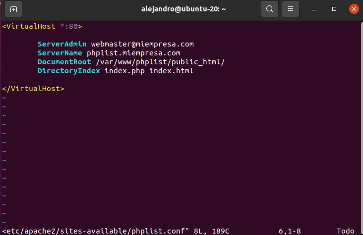
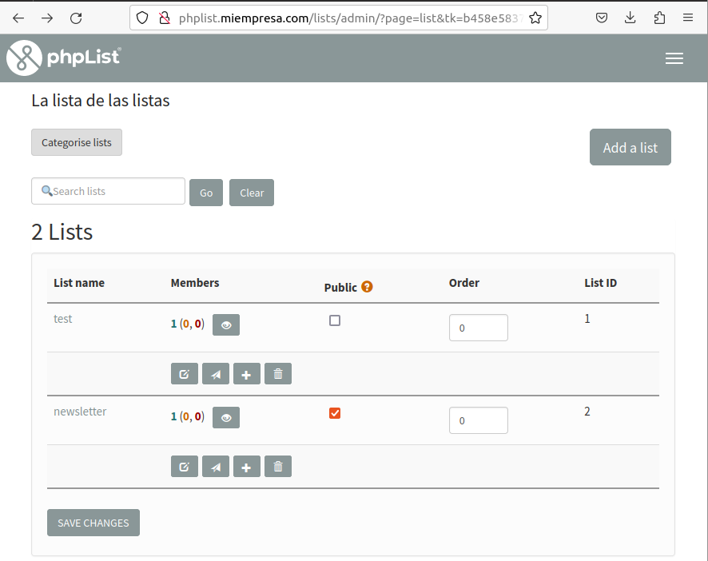
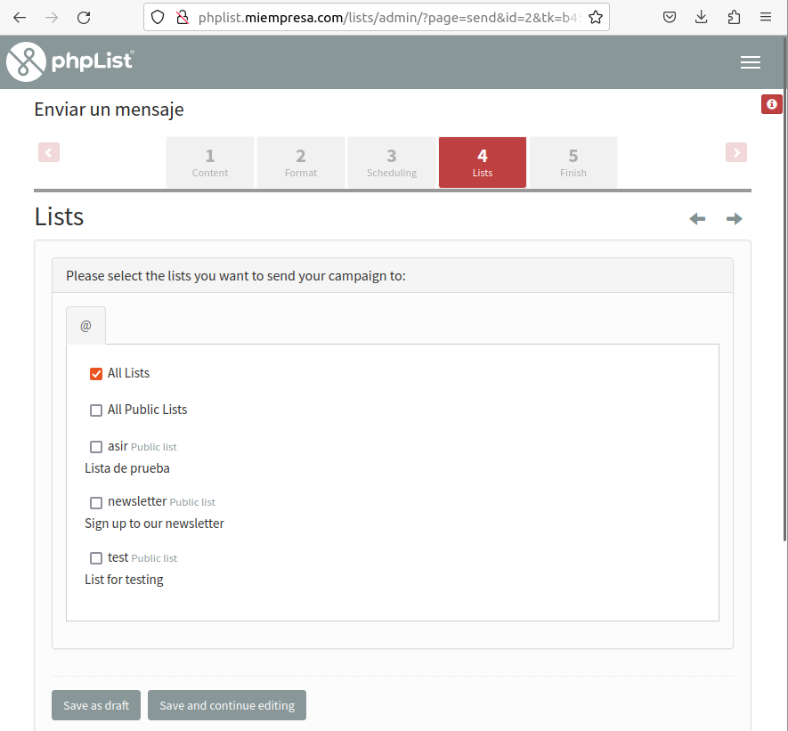

# Listas de Distribución - Ubuntu 18.04

```
Alejandro de Paz Hernández
```

# 1. Introducción

Vamos a instalar y configurar un servidor de mensajería instantánea, que nos permitirá establecer comunicación en tiempo real entre dos o más usuarios en formato texto. Para ello, utilizaremos el software **OpenFire** y **Spark**.

---

# 2. phpList

> Para poder realizar la instalación de phpList, primero tendremos que tener instalado Apache, php y MySQL. 

Descargamos el .zip de la página oficial de **[phplist](https://www.phplist.org/download-phplist/)**. A continuación, creamos una base de datos y un usuario con todos los privilegios sobre esta:


Una vez creada la base de datos y el usuario, los añadimos en el fichero de configuración de **phpList** `/var/www/phplist/public_html/lists/config/config.php`:


Añadimos un nuevo virtualhost en Apache y lo habilitamos:




Si ahora nos dirigimos a `phplist.miempresa.com/lists/admin` desde un navegador, podremos empezar la instalación de **phpList** clickando en *Initialize database*:


Una vez finalizado, tendremos acceso al panel de administración de **phpList**:


Desde ahí, podemos crear nuevos usuarios, campañas, listas...

* Para crear un usuario, nos vamos a `Suscriptores → Lista de todos los usuarios → Añadir un usuario`:


* Para crear una lista, nos vamos a `Suscriptores → Lista de listas → Añadir una lista`:




* Para configurar una página de suscripción, nos vamos a `Config → Páginas de inscripción → Añadir una página de inscripción`:


* Para configurar una campaña, nos vamos a `Campaña → Enviar nueva campaña`:





