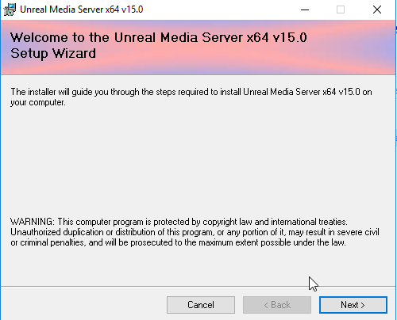
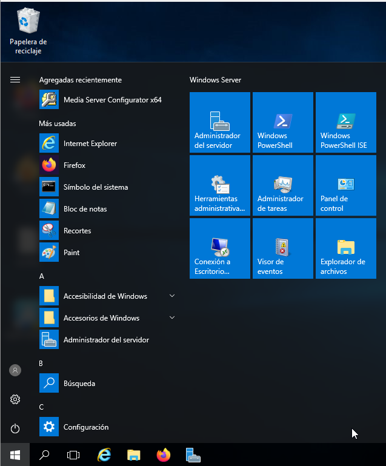
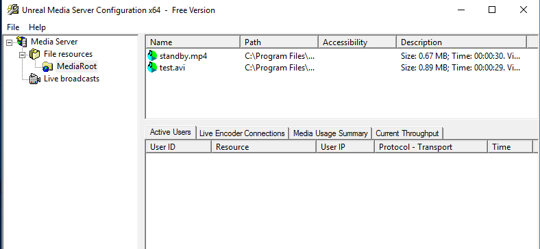
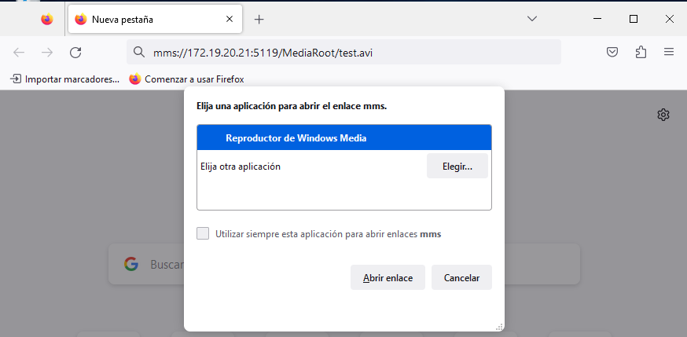
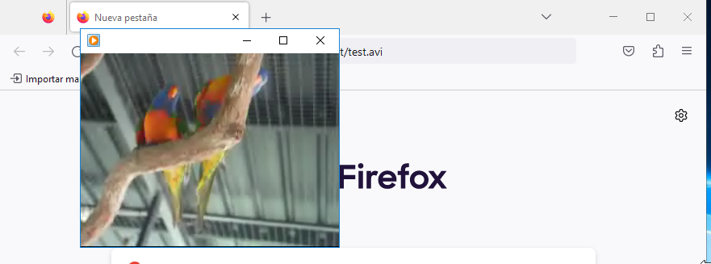
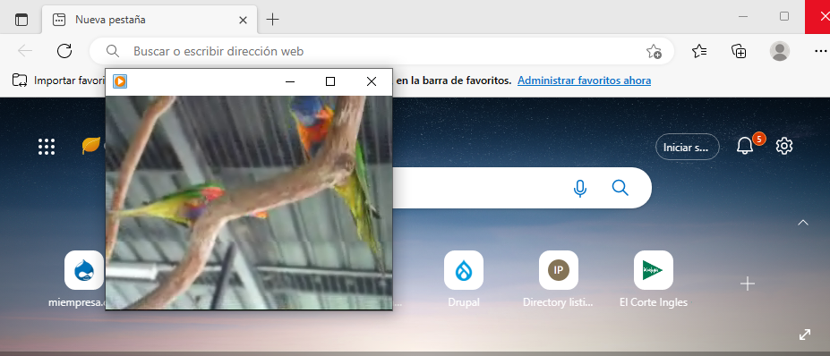

# Servicio de Streaming - Windows Server 2016

```
Alejandro de Paz Hernández
```

# 1. Introducción

Vamos a instalar y configurar un servidor de mensajería instantánea, que nos permitirá establecer comunicación en tiempo real entre dos o más usuarios en formato texto. Para ello, utilizaremos el software **OpenFire** y **Spark**.

---

# 2. Unreal Media Server

Lo primero será descargar e instalar la versión gratuita de **[Unreal Media Server](http://www.umediaserver.net/umediaserver/download.html)**. Descomprimimos el .zip y ejecutamos el .exe:



Dejamos la configuración por defecto y finalizamos la instalación. Veremos que ahora en el menú de aplicaciones de Windows nos aparece el asistente para configurar Unreal Media Server:



Si entramos, veremos que hay dos archivos de prueba en `File Resources > MediaRoot`:



Podemos visualizar estos archivos si introducimos `mms://172.19.20.21:5119/MediaRoot/test.avi` en el navegador y tenemos un reproductor multimedia válido:





También lo podemos visualizar desde un cliente:



