# VoIP Linux

```
Alejandro de Paz Hernández
```

# 1. Introducción

Vamos a instalar y configurar un servidor VoIP en Linux, que nos permitirá realizar llamadas de voz y vídeo entre distintos clientes. Para ello, crearemos una MV con una ISO que contiene todo el software necesario para poner en funcionamiento el servidor VoIP.

---

# 2. FreePBX

Descargamos la ISO de **[FreePBX](https://www.freepbx.org/)** y creamos una nueva MV con ella. Seleccionamos la instalación por defecto y esperamos a que termine:


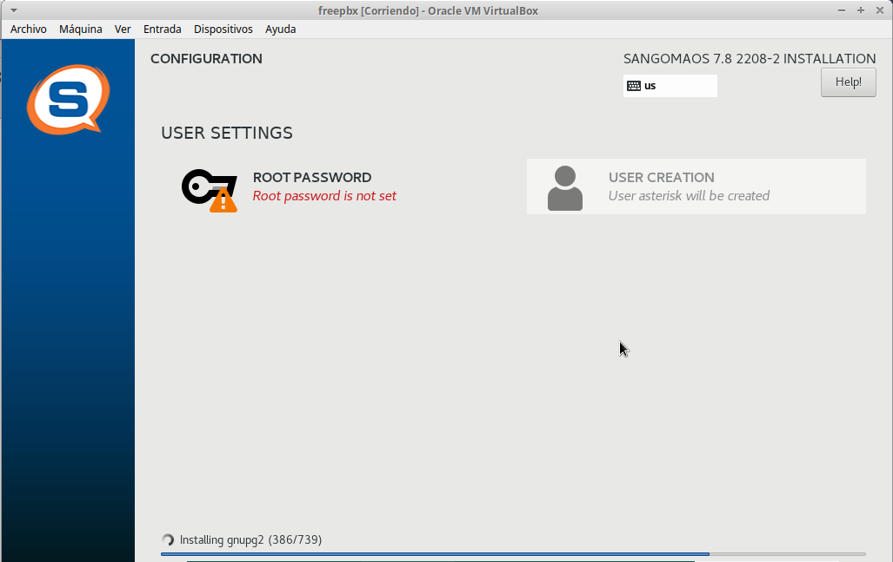

Una vez termine, establecemos una contraseña para el usuario root y reiniciamos la máquina. Una vez iniciada, introducimos la contraseña establecida anteriormente y tendremos acceso a un terminal:

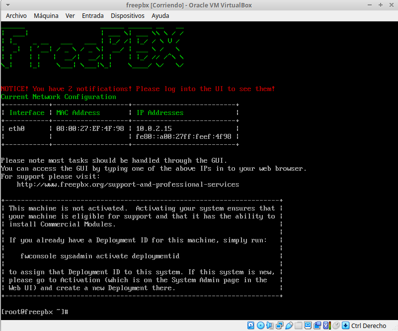

A continuación, nos vamos a una máquina Ubuntu e introducimos la IP del servidor en un navegador para comenzar la configuración. Introducimos un usuario (administrador) y contraseña:

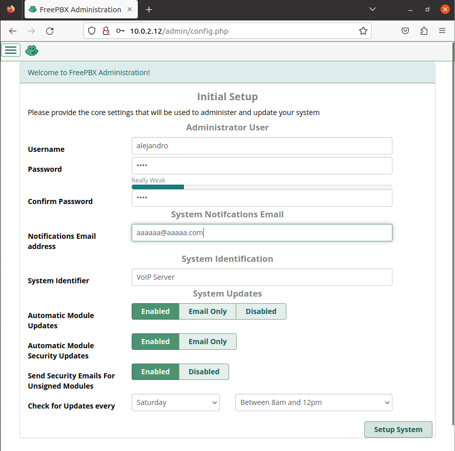

Al crear el usuario, nos aparecerá la siguiente ventana. Seleccionamos `FreePBX Administration`:


Activamos el servidor y saltamos toda la publicidad que nos aparecerá. Llegado cierto punto nos preguntará si queremos activar el Firewall y establecer la IP de la máquina Ubuntu como IP de confianza, le decimos que sí.


Ahora nuestro servidor estará en funcionamiento. Nos vamos a `Applications → Extensions → Add Extension → PJSIP Extension` para crear nuevos usuarios:


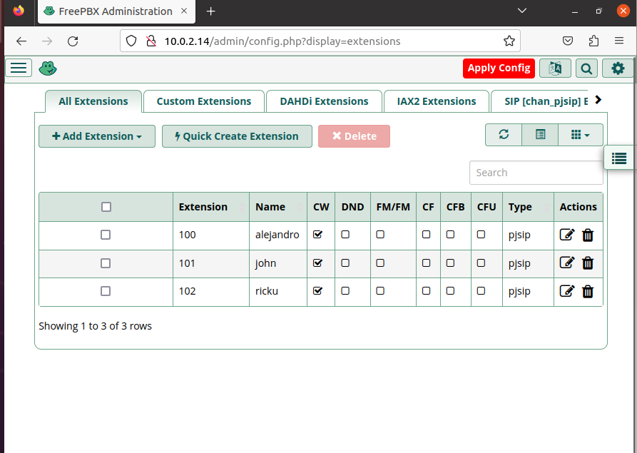

> Hemos cambiado la extensión de 9000 a 100 debido a errores al utilizar la primera.

Una vez creados, clickamos en `Apply Config` para actualizar el servidor. 

# 3. Zoiper5

Ahora que tenemos el servidor en funcionamiento, solo nos falta un cliente para realizar llamadas. Utilizaremos **zoiper5** para ello. Descargamos el software desde la página oficial y lo instalamos:

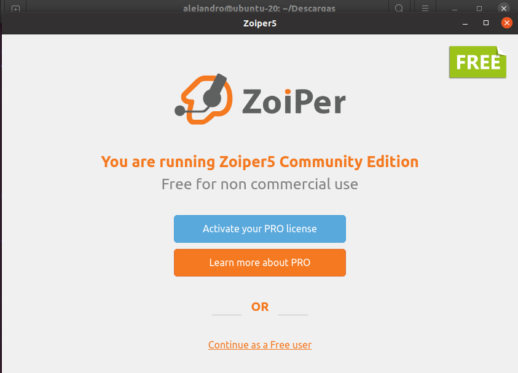

Introducimos la extensión del usuario que queremos agregar y la contraseña:

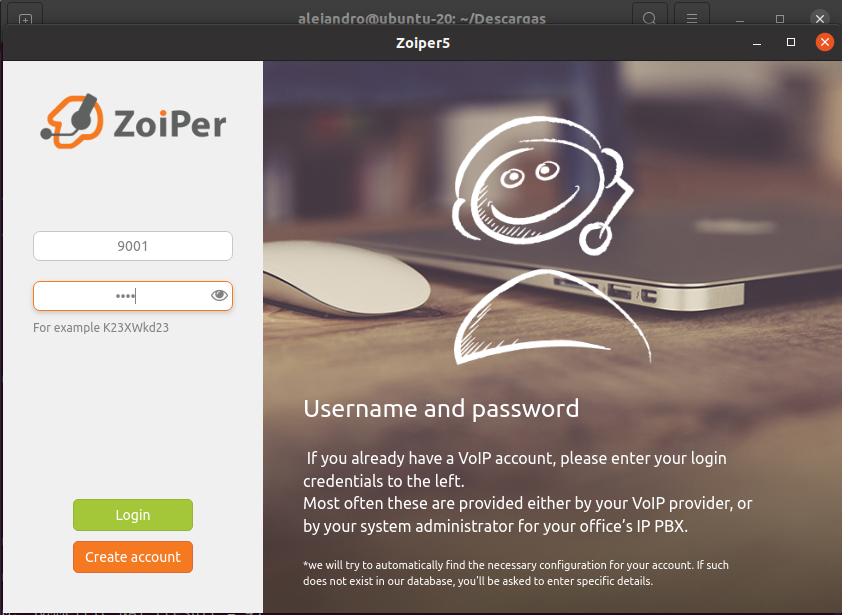

Introducimos la IP del servidor (máquina con FreePBX) y probamos la conexión. Basta con que detecte el protocolo UDP:

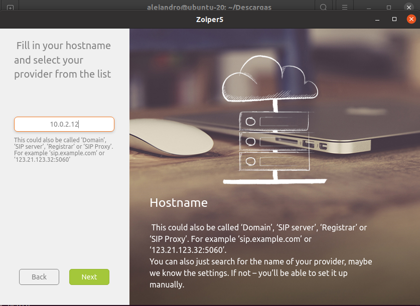

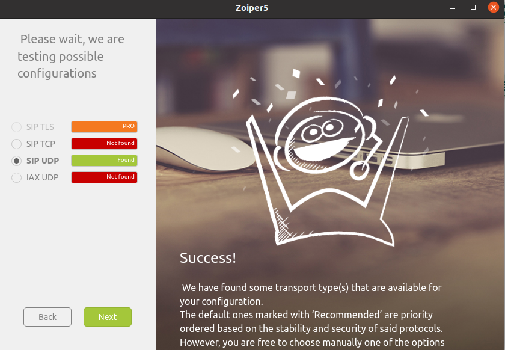

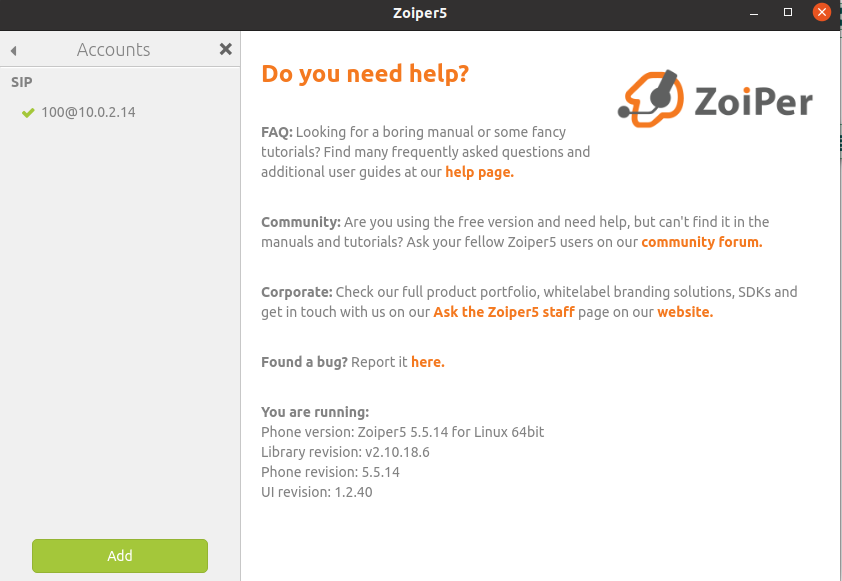

Probamos llamadas entre los distintos usuarios:

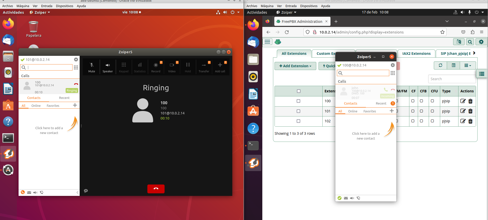

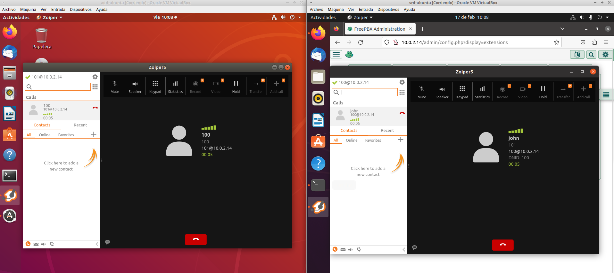

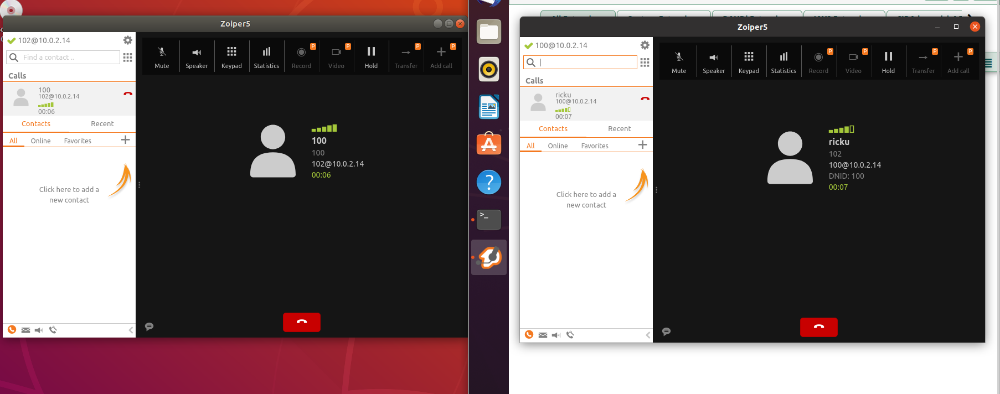


