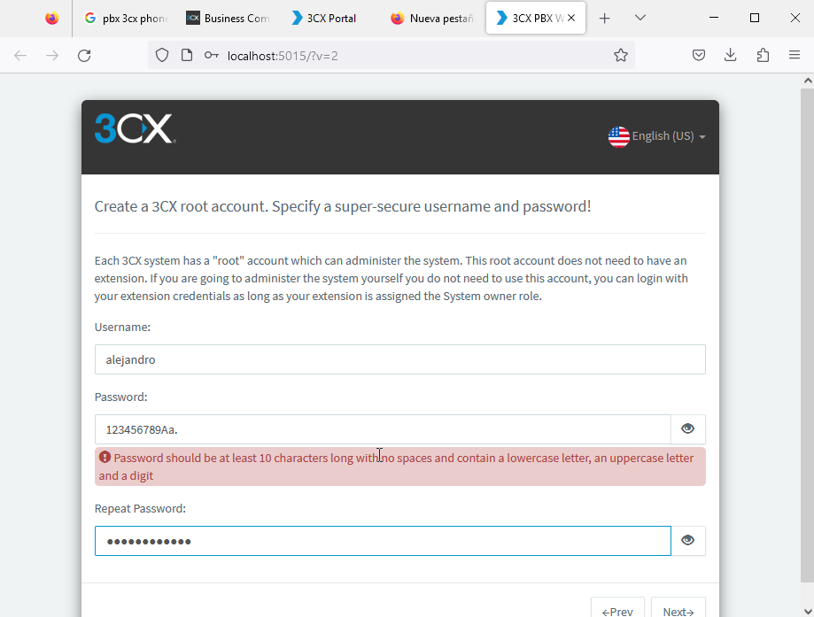
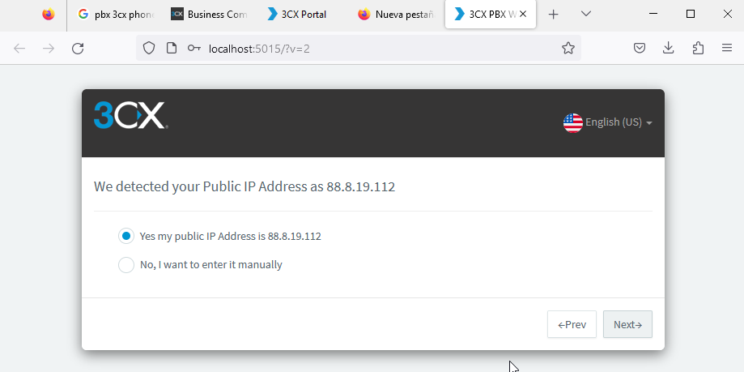
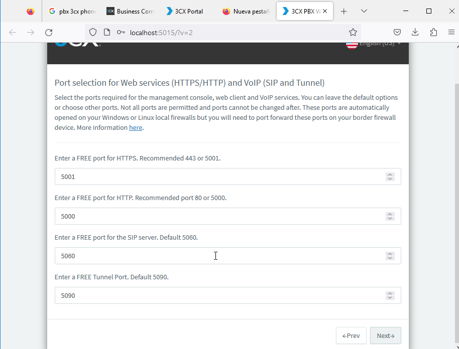
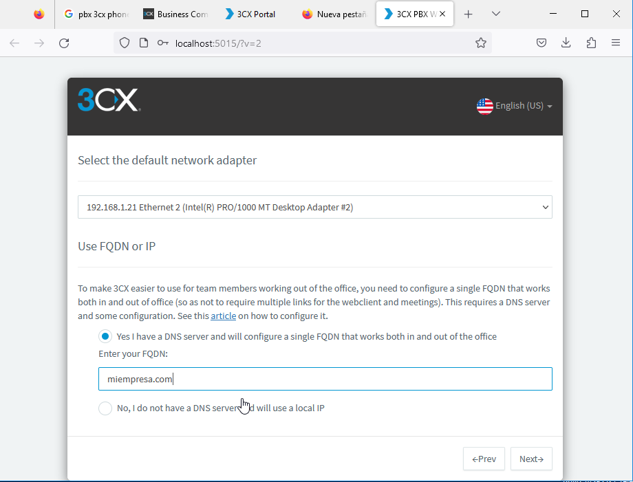

# Servicio de Streaming - Ubuntu 18.04

```
Alejandro de Paz Hernández
```

# 1. Introducción

Vamos a instalar y configurar un servidor de streaming, esta vez en Linux utilizando **Icecas2t** y **ices2**.

---

# 2. Icecast2

Empezamos descargando e instalando el paquete **icecast2**:


Una vez instalado, editamos el fichero de configuración `/etc/icecast2/icecast.xml` y modificamos las etiquetas `<source-password>, <admin-user> y <admin-password>` con los datos que queramos:


Editamos también el fichero `/etc/default/icecast` y añadimos la siguiente línea:


Iniciamos el servicio e instalamos el codificador **ices2**:


Creamos un directorio para el codificador y copiamos el fichero de configuración por defecto:


Editamos dicho fichero e introducimos la información de nuestra radio:


Introducimos también la información referente al puerto de escucha y el punto de montaje. Si tenemos un servidor apache activo, tendremos que cambiar el puerto 8000, ya que Apache lo estará utilizando:


Descargamos ficheros de audio en formato *.ogg* e introducimos las rutas en el fichero `/etc/icecast2/playlist.txt`:



Creamos el directorio `/var/log/ices2` y lo introducimos en el fichero de configuración de **ices2**. Ejecutamos el codificador en segundo plano y accedemos desde un navegador:




Vemos que ya desde este panel tenemos la radio funcionando. Entramos al panel de administración con las credenciales definidas anteriormente:







Podemos hacer lo mismo desde un cliente Windows, por ejemplo:


Por último, podemos reproducir el audio desde un reproductor multimedia como **VLC**. Para ello, nos vamos a `Medio > Emitir > Red`:


