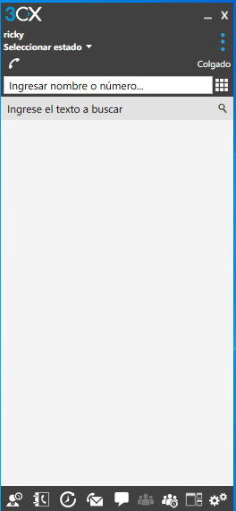

# VoIP Windows

```
Alejandro de Paz Hernández
```

# 1. Introducción

Vamos a instalar y configurar un servidor VoIP en Windows, que nos permitirá realizar llamadas de voz y vídeo entre distintos clientes.

---

# 2. 3CX Phone System

Lo primero será registrarnos en la página web de 3CX y descargar **[3CX Phone System](https://www.3cx.com/phone-system/)**. Antes de descargarlo, tendremos que elegir algunas opciones de configuración:

* Elegimos la opción de autohospedado, que es la opción gratuita, y elegimos hospedarlo en nuestra propia máquina:


* Seleccionamos un FQDN para el servidor:


* Finalmente, seleccionamos la plataforma en la que vamos a instalar el servidor y copiamos la clave de activación:


Al ejecutar el .exe, se nos abrirá un terminal con dos opciones. Elegimos la primera opción y procedemos a la instalación a través de un navegador:


Introducimos la clave de activación y creamos un usuario:


Dejamos el resto de opciones como vienen por defecto hasta llegar a la siguiente ventana. Aquí introducimos el adaptador de red que utilizaremos y elegimos un servidor DNS que hayamos creado previamente:


Elegimos la longitud que tendrán nuestras extensiones y el idioma, país y zona horaria:


Creamos una primera extensión que tendrá permisos de administrador. Habilitamos las llamadas desde España (vendrá marcado por defecto):


Finalmente, la instalación se habrá completado y podremos poner en marcha el servidor a través de la url y contraseña que nos proporcionan:


Creamos dos usuarios/extensiones más:


A continuación, para comprobar que el servidor funciona y realizar llamadas, tendremos que solicitar un e-mail de recuperación de contraseña con cada usuario para poder iniciar sesión en los clientes desde el fichero que nos enviarán al correo (el código QR que nos proporcionan no funciona correctamente). Una vez hecho eso, descargamos la app 3CX Phone y abrimos el fichero con dicha aplicación. Por último, probamos a realizar una llamada:

</img>


Vemos que la llamada queda registrada:


Ahora vamos a probar desde un cliente Windows. Descargamos SIP softphone 3CX Phone y abrimos el fichero que nos ha llegado al correo con dicha aplicación:



Probamos a realizar llamadas:


También podemos realizar llamadas entre el cliente y el teléfono móvil:

</img>


